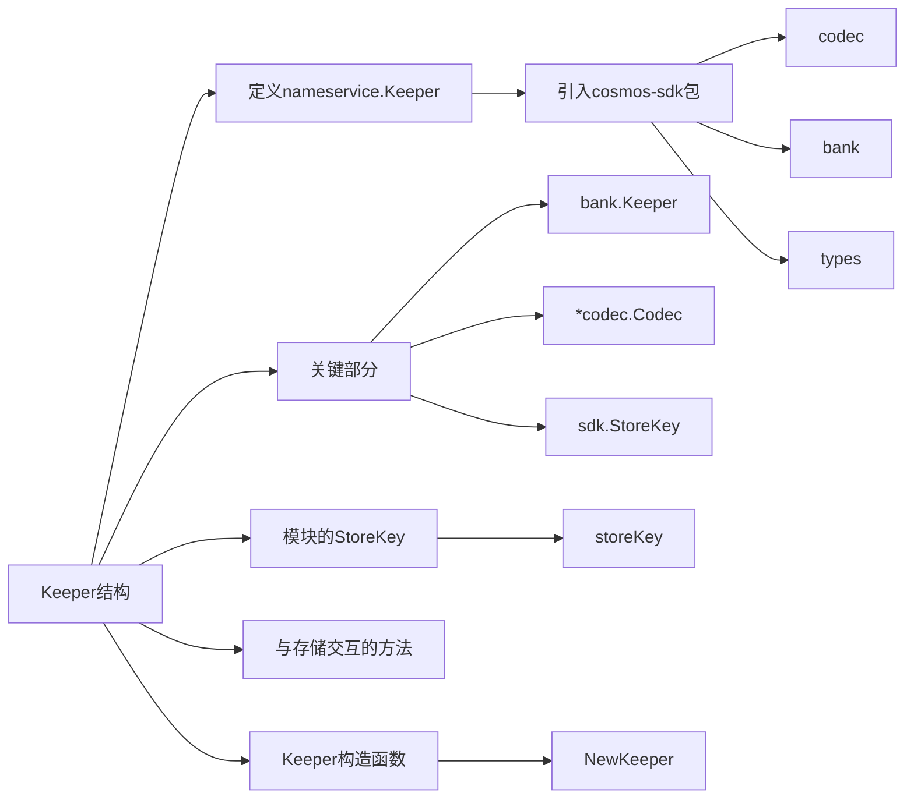
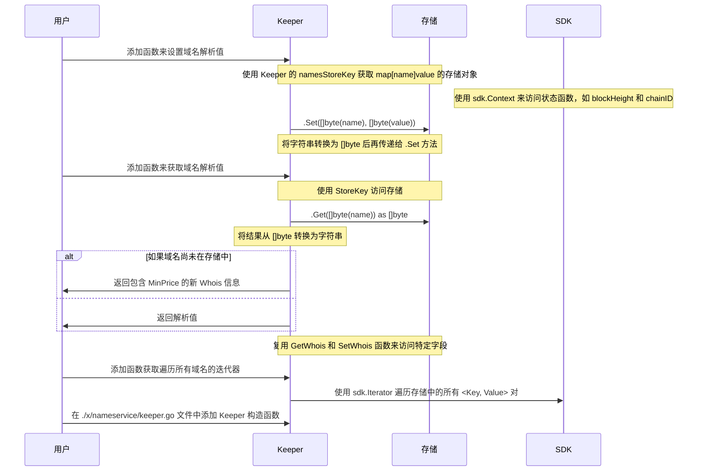

```mermaid
graph LR  
    C[Keeper结构]  
    C --> D[定义nameservice.Keeper]  
    D --> E[引入cosmos-sdk包]  
    E --> F[codec]  
    E --> G[bank]  
    E --> H[types]  
    C --> I[关键部分]  
    I --> J[bank.Keeper]  
    I --> K[*codec.Codec]  
    I --> L[sdk.StoreKey]  
    C --> M[模块的StoreKey]  
    M --> N[storeKey]  
    C --> O[与存储交互的方法]  
    
    C --> Z[Keeper构造函数]  
    Z --> AA[NewKeeper]
```

# 关键部分

```mermaid
sequenceDiagram
    participant 用户
    participant Keeper
    participant 存储
    participant SDK

    用户 ->> Keeper: 添加函数来设置域名解析值
    Note over Keeper, 存储: 使用 Keeper 的 namesStoreKey 获取 map[name]value 的存储对象
    Note over SDK: 使用 sdk.Context 来访问状态函数，如 blockHeight 和 chainID

    Keeper ->> 存储: .Set([]byte(name), []byte(value))
    Note over Keeper, 存储: 将字符串转换为 []byte 后再传递给 .Set 方法

    用户 ->> Keeper: 添加函数来获取域名解析值
    Note over Keeper, 存储: 使用 StoreKey 访问存储

    Keeper ->> 存储: .Get([]byte(name)) as []byte
    Note over Keeper: 将结果从 []byte 转换为字符串

    alt 如果域名尚未在存储中
        Keeper ->> 用户: 返回包含 MinPrice 的新 Whois 信息
    else
        Keeper ->> 用户: 返回解析值
    end

    Note over Keeper, 存储: 复用 GetWhois 和 SetWhois 函数来访问特定字段

    用户 ->> Keeper: 添加函数获取遍历所有域名的迭代器
    Keeper ->> SDK: 使用 sdk.Iterator 遍历存储中的所有 <Key, Value> 对

    用户 ->> Keeper: 在 ./x/nameservice/keeper.go 文件中添加 Keeper 构造函数
```