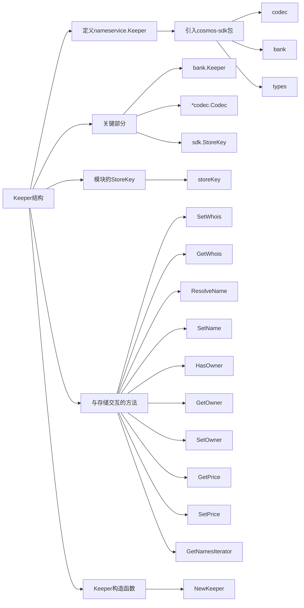

```mermaid
graph LR  
    C[Keeper结构]  
    C --> D[定义nameservice.Keeper]  
    D --> E[引入cosmos-sdk包]  
    E --> F[codec]  
    E --> G[bank]  
    E --> H[types]  
    C --> I[关键部分]  
    I --> J[bank.Keeper]  
    I --> K[*codec.Codec]  
    I --> L[sdk.StoreKey]  
    C --> M[模块的StoreKey]  
    M --> N[storeKey]  
    C --> O[与存储交互的方法]  
    O --> P[SetWhois]  
    O --> Q[GetWhois]  
    O --> R[ResolveName]  
    O --> S[SetName]  
    O --> T[HasOwner]  
    O --> U[GetOwner]  
    O --> V[SetOwner]  
    O --> W[GetPrice]  
    O --> X[SetPrice]  
    O --> Y[GetNamesIterator]  
    C --> Z[Keeper构造函数]  
    Z --> AA[NewKeeper]
```