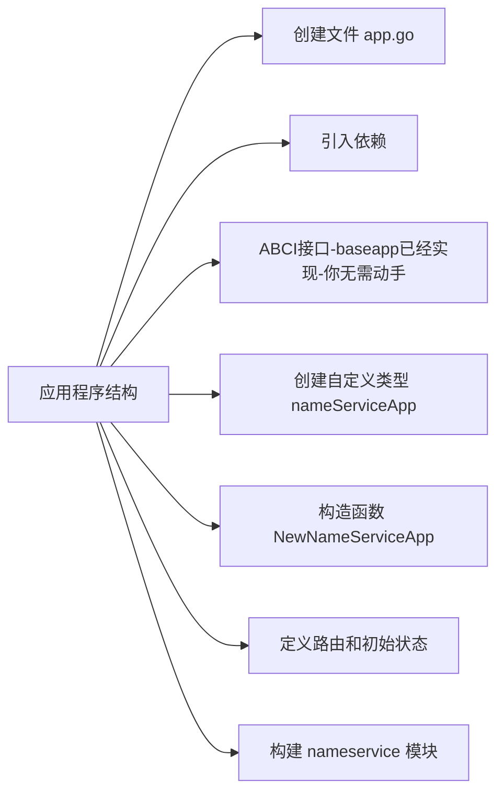
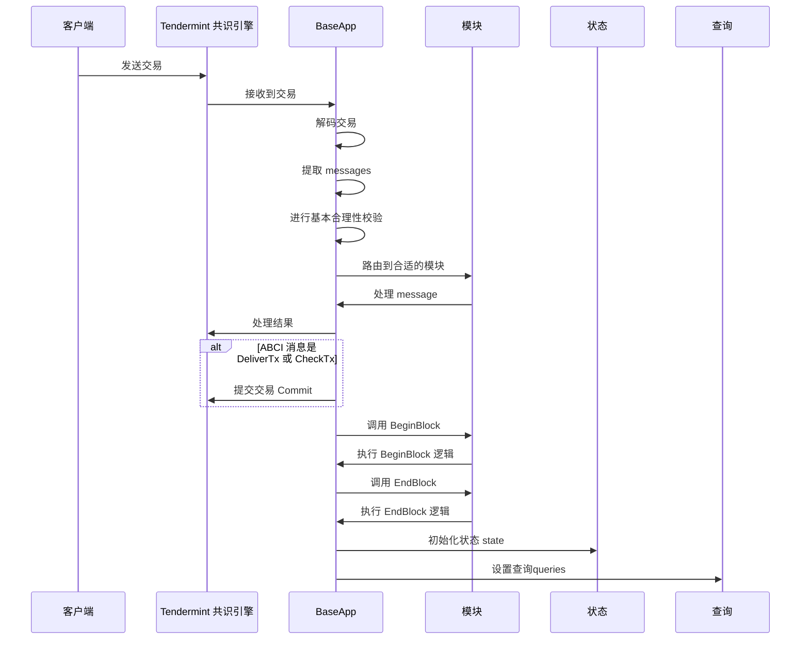

```mermaid
graph LR  
    A[应用程序结构]  
    A1[创建文件 app.go]  
    A2[引入依赖]  
    A3[ABCI接口-baseapp已经实现-你无需动手]  
    A4[创建自定义类型 nameServiceApp]  
    A5[构造函数 NewNameServiceApp]  
    A6[定义路由和初始状态]  
    A7[构建 nameservice 模块]  

    A --> A1  
    A --> A2  
    A --> A3  
    A --> A4  
    A --> A5  
    A --> A6  
    A --> A7
```

# 引入依赖

- log: Tendermint 的日志
- auth: Cosmos SDK 的auth模块
- dbm: Tendermint 的数据库代码
- baseapp: 如下

# BaseApp
 

```mermaid

sequenceDiagram  
    participant Client as 客户端  
    participant Tendermint as Tendermint 共识引擎  
    participant BaseApp as BaseApp  
    participant Module as 模块  
    participant State as 状态  
    participant Query as 查询  

    Client->>Tendermint: 发送交易  
    Tendermint->>BaseApp: 接收到交易  
    BaseApp->>BaseApp: 解码交易  
    BaseApp->>BaseApp: 提取 messages  
    BaseApp->>BaseApp: 进行基本合理性校验  
    BaseApp->>Module: 路由到合适的模块  
    Module->>BaseApp: 处理 message  
    BaseApp->>Tendermint: 处理结果  

    alt ABCI 消息是 DeliverTx 或 CheckTx  
        BaseApp->>Tendermint: 提交交易 Commit
    end  

    BaseApp->>Module: 调用 BeginBlock  
    Module->>BaseApp: 执行 BeginBlock 逻辑  
    BaseApp->>Module: 调用 EndBlock  
    Module->>BaseApp: 执行 EndBlock 逻辑  

    BaseApp->>State: 初始化状态  state
    BaseApp->>Query: 设置查询queries
```