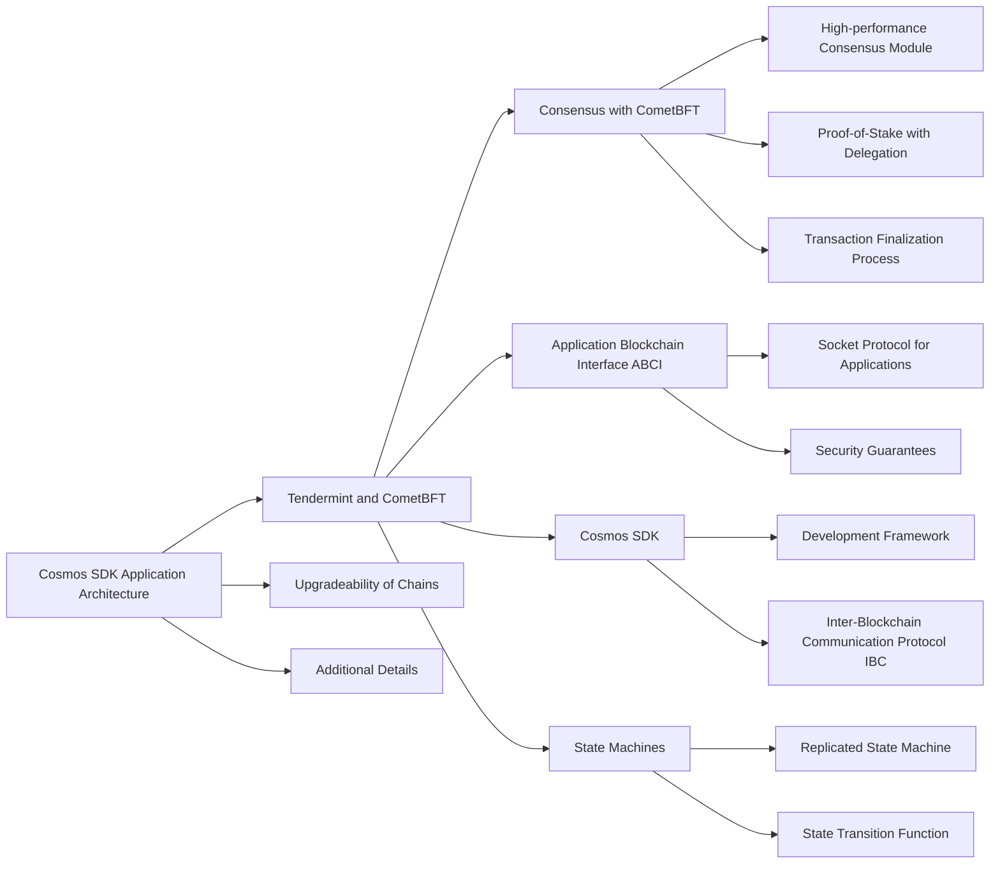
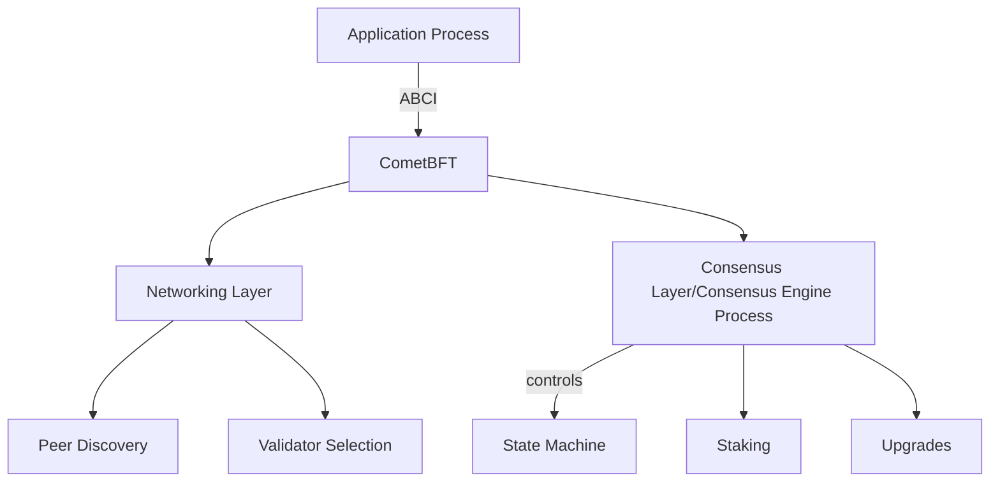
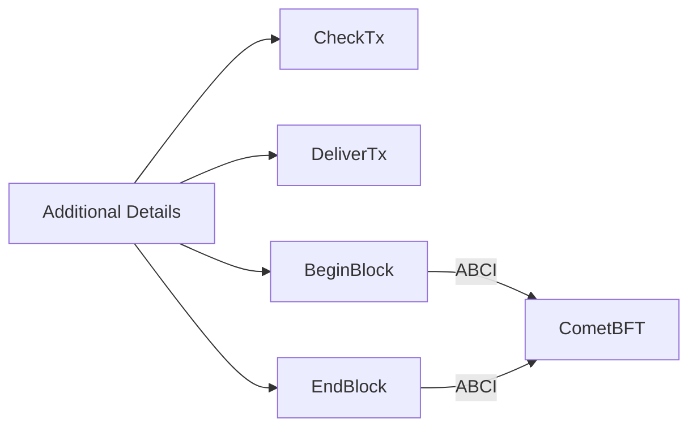

# A Blockchain App Architecture

# ABCI

* **checkTx**:  ask the application layer if a transaction is valid. 
* **deliverTx**: state machine transition
* **beginBlock & endBlock**: 

# 设计程序

设计一个下棋项目, 玩家可以互相对弈, 使用最简单的规则. 目的是理解abci和学习如何使用cosmos-sdk, 不要被游戏规则和实现逻辑绕进去了(那不是重点).

