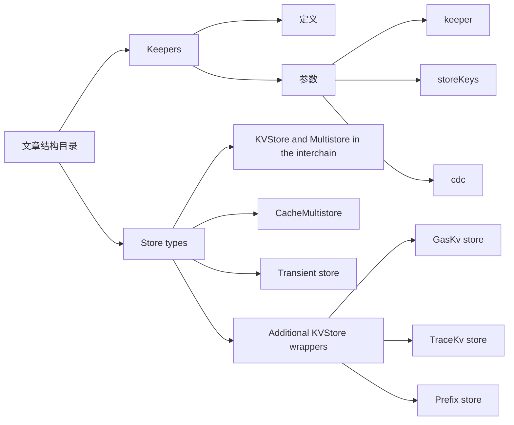
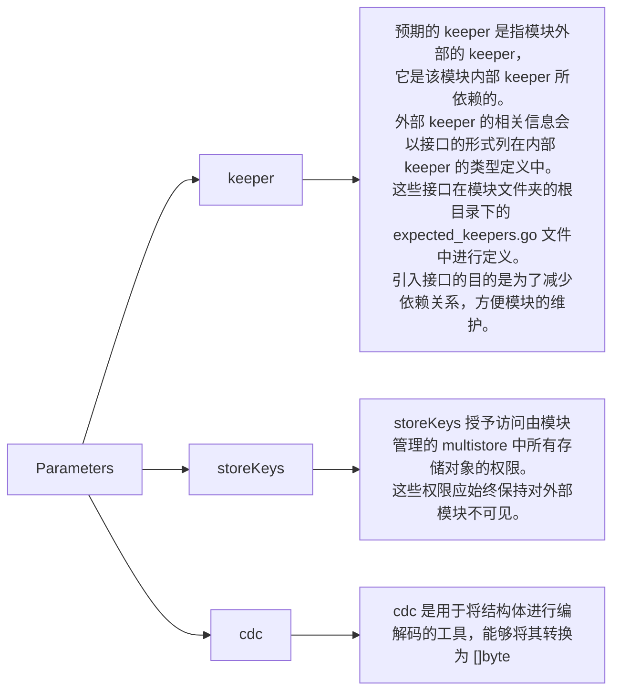
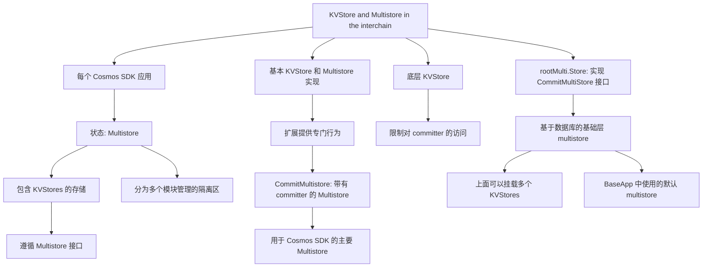
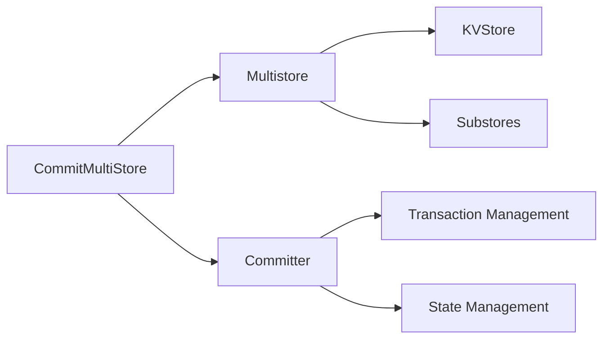
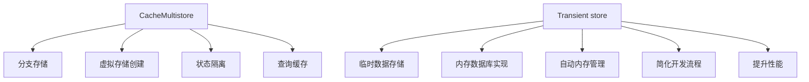
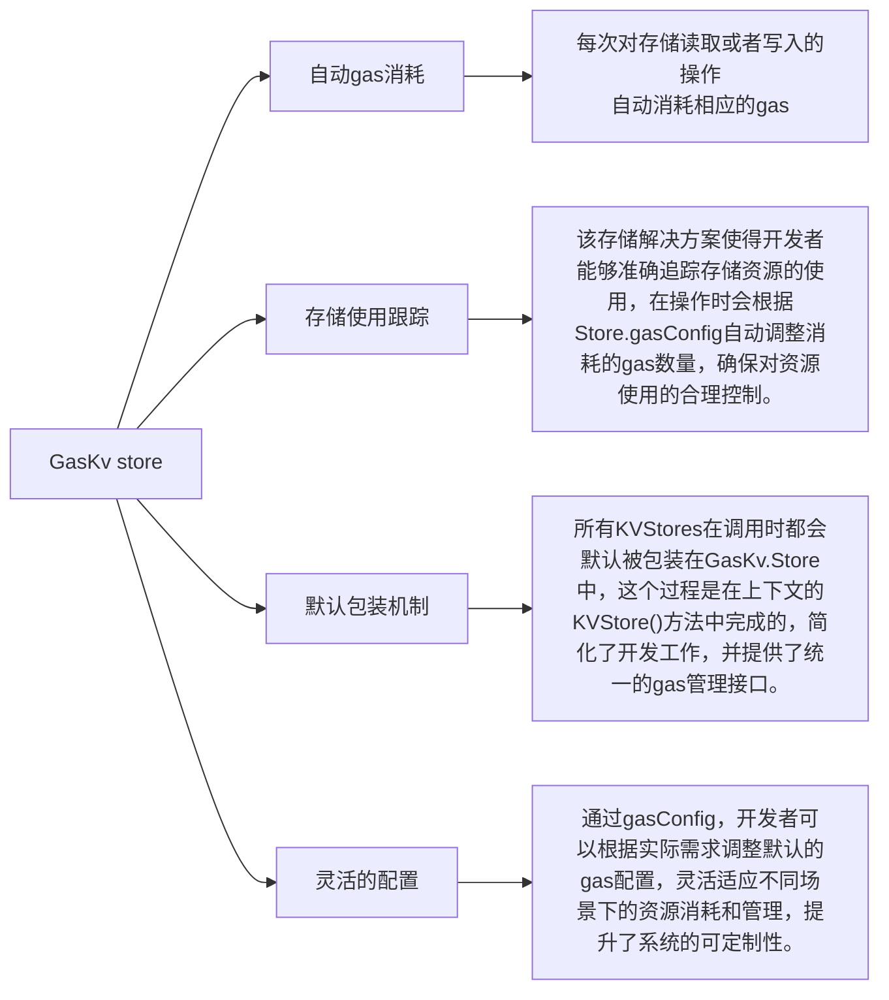
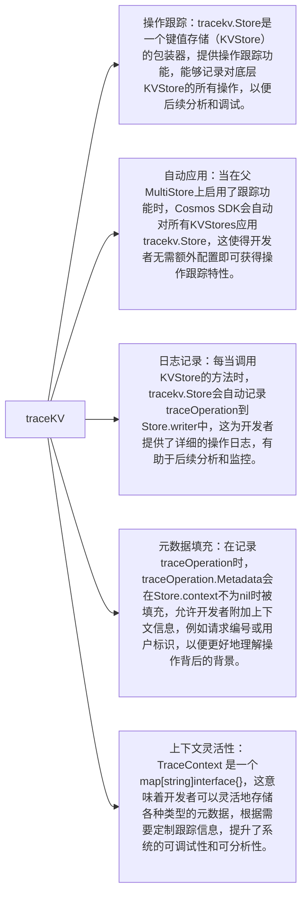
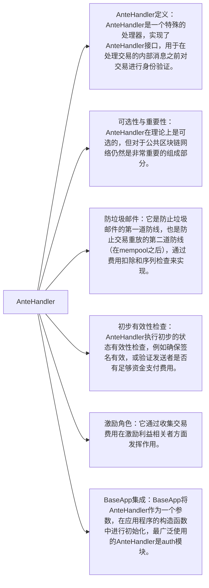
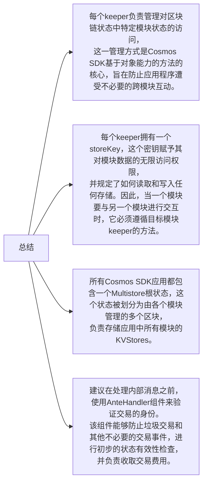

# Multistore and Keepers






# CommitMultiStore
`CommitMultiStore` 是 Cosmos SDK 中的一种 `Multistore` 实现，它带有一个提交器（committer）。这是 Cosmos SDK 中使用的主要多存储类型。`CommitMultiStore` 允许对多个 `KVStore` 进行管理，并在每个区块结束时提交状态变化。它的设计旨在确保在处理交易时能够有效地管理和维护应用程序的状态。


# CacheMultistore & TransientStore


分支存储（Branch Store）是一种存储设计模式，主要用于管理和维护数据状态的不同版本或者变体。其核心思想是在不直接修改主存储的情况下，创建一个或多个独立的存储分支，以便对数据进行实验性或临时的变更。这在以下几种场景中非常有用：

# GasKV


# traceKV


# prefix store

* **键前缀化**：prefix.Store是一个KVStore的包装器，提供自动的键前缀功能，允许开发者为存储中的键添加统一的前缀，以便更好地组织和管理数据。

* **自动转发操作**：当调用Store.{Get, Set}()方法时，prefix.Store会自动将请求转发到其父KVStore，同时在键的前面添加Store.prefix，这样可以简化对存储的操作并保持键的一致性。

* **避免键冲突**：通过使用前缀，prefix.Store能够有效避免不同模块或组件之间的键冲突，从而帮助开发者在同一存储中管理多个子存储。

* **迭代器的特殊处理**：在调用Store.Iterator()时，prefix.Store不简单地在父存储的基础上添加前缀，因为这种方式可能导致遍历时包含一些不以该前缀开头的元素，从而导致意外结果。因此，prefix.Store在实现迭代器时采取了更复杂的处理策略，以确保仅遍历相应的前缀元素。

* **灵活的数据组织**：prefix.Store提供了一种灵活的数据组织方式，使得应用程序能够高效地管理和检索关联数据，特别适用于需要在同一存储中处理多种数据类型或来源的场景。


# AnteHandler



# 总结




# 伪代码

我们现在有一个checker游戏, 现在我们要设计怎么存放游戏数据, 使用cosmos-sdk提供的KV存储

一个初步的想法是: 为每局游戏分配一个ID，并根据这个 ID 来存储游戏的相关信息。为了使结构更清晰，并在未来能够与其他存储项目区分开来，您可以为每个 ID 添加一个前缀。以下是存储结构的示例：

```go
var globalStore sdk.KVStore
// checkersStore := globalStore.getAtPrefix("checkers-")
// gamesStore := checkersStore.getAtPrefix("games-")
// storedGame := gamesStore.getAtPrefix(gameId)

// 每个 ID 添加一个前缀
storedGame := globalStore.getAtPrefix("checkers-games-" + gameId)
```

定义 StoredGame 的 ID。要返回单个对象，请在对象的值中包含 Index：
```
type StoredGame struct {
    ...
    Index string
}
```

定义所需的前缀：
```
package types

const (
    StoredGamesKey = collections.NewPrefix("StoredGame/value/")
)
```


```
package keeper

type Keeper struct {
    ...
    StoredGames collections.Map[string, checkers.StoredGame]
}

func NewKeeper(cdc codec.BinaryCodec, addressCodec address.Codec, storeService storetypes.KVStoreService, authority string) Keeper {
    k := Keeper{
        ...
        StoredGames: collections.NewMap(sb,
            checkers.StoredGamesKey, "storedGames", collections.StringKey,
            codec.CollValue[checkers.StoredGame](cdc)),
    }
    ...
}
// 通过id访问game对象
func (k Keeper) GetStoredGame(ctx sdk.Context, gameId string) (storedGame checkers.StoredGame, err error) {
    return k.StoredGames.Get(ctx, gameId)
}
```

如果您想保存游戏：
```
func (k Keeper) SetStoredGame(ctx sdk.Context, gameId string, storedGame checkers.StoredGame) error {
    return k.StoredGames.Set(ctx, gameId, storedGame) 
}
```

同样，如果您想删除已存储的游戏，请调用：
```
k.StoredGames.Remove(ctx, storedGame.Index)
```

KVStore 还允许您获取给定前缀上的迭代器。您可以列出所有存储的游戏，因为它们共享相同的前缀，您可以使用以下操作：

```
func (k Keeper) GetAllStoredGame(ctx context.Context) ([]checkers.StoredGame, error) {
    var storedGames []checkers.StoredGame
    if err := k.StoredGames.Walk(ctx, nil, func(index string, storedGame checkers.StoredGame) (bool, error) {
        storedGames = append(storedGames, storedGame)
        return false, nil
    }); err != nil {
        return nil, err
    }

    return storedGames, nil
}
```