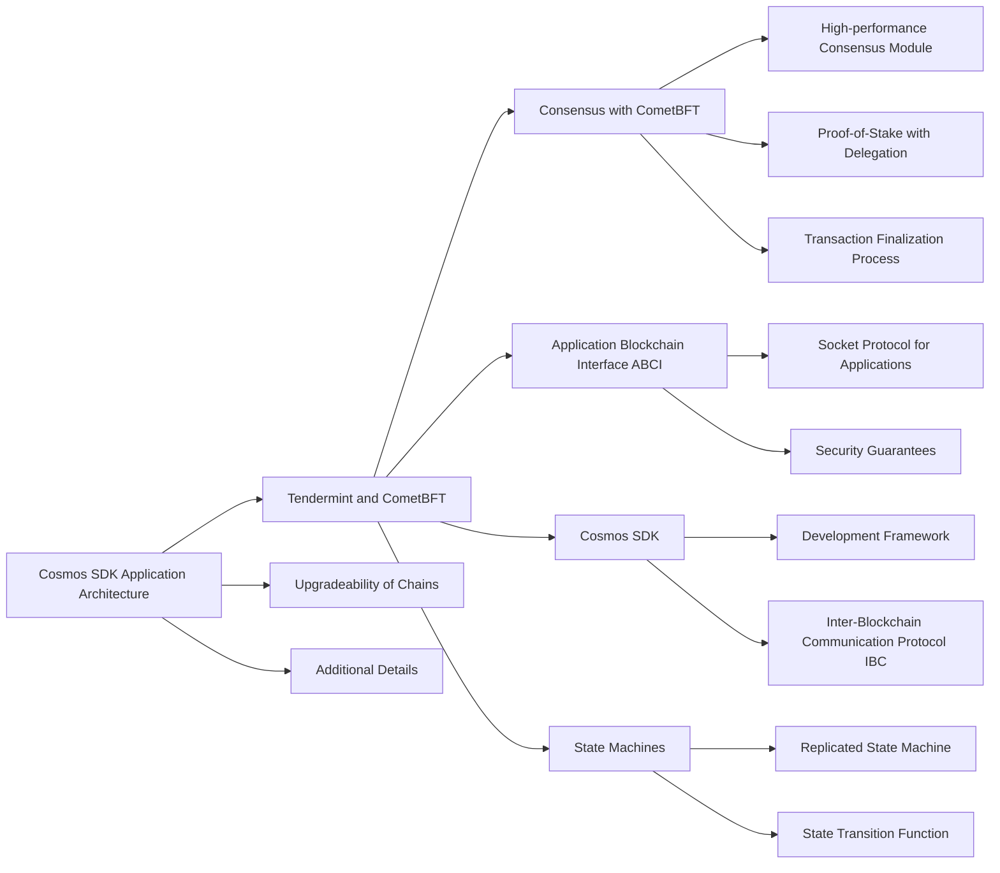
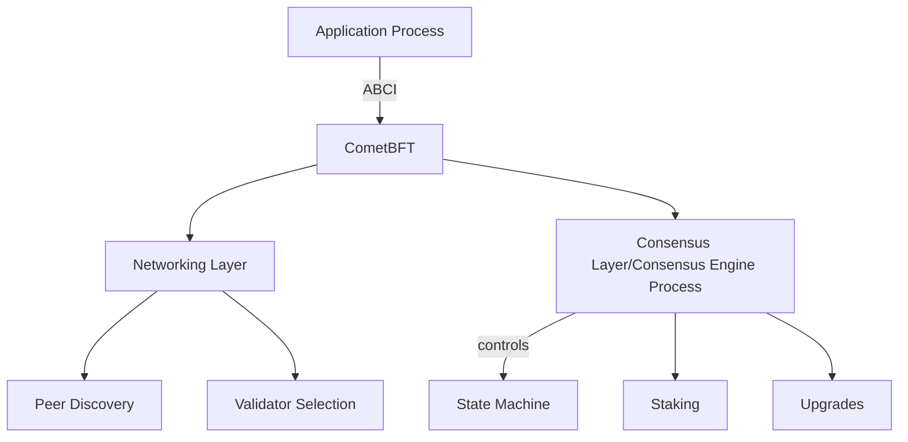
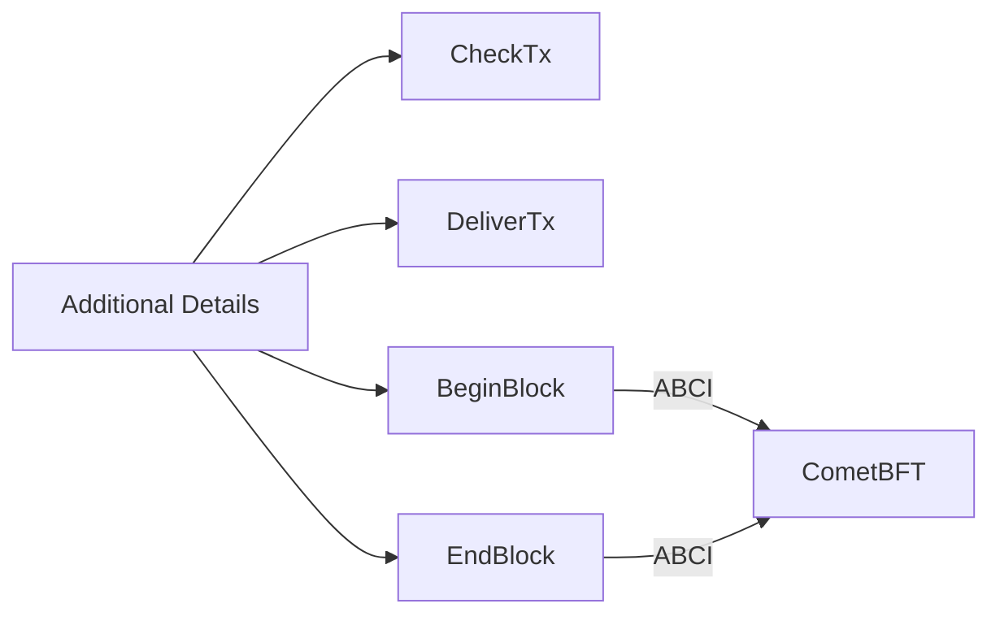

# A Blockchain App Architecture

```mermaid
flowchart LR
    A[Cosmos SDK Application Architecture] --> B[Tendermint and CometBFT]
    B --> C[Consensus with CometBFT]
    B --> D[Application Blockchain Interface ABCI]
    B --> E[Cosmos SDK]
    B --> F[State Machines]
    
    C --> G[High-performance Consensus Module]
    C --> H[Proof-of-Stake with Delegation]
    C --> I[Transaction Finalization Process]
    
    D --> J[Socket Protocol for Applications]
    D --> K[Security Guarantees]
    
    E --> L[Development Framework]
    E --> M[Inter-Blockchain Communication Protocol IBC]
    
    F --> N[Replicated State Machine]
    F --> O[State Transition Function]
    
    A --> P[Upgradeability of Chains]
    A --> Q[Additional Details]
```

# ABCI

```mermaid
flowchart TD 

    A[CometBFT] --> B[Networking Layer]  
    I[Application Process]  -- ABCI --> A
    A --> C[Consensus Layer/Consensus Engine Process]  
    B --> E[Peer Discovery]  
    B --> F[Validator Selection]  
    C -- controls --> H[State Machine]  
    C --> J[Staking]  
    C --> K[Upgrades]  
```

```mermaid
flowchart LR
    Q[Additional Details]
    Q --> A[CheckTx]
    Q --> B[DeliverTx]
    Q --> C[BeginBlock]
    C --ABCI--> F[CometBFT]
    D -- ABCI--> F[CometBFT]
    Q --> D[EndBlock]

```

* **checkTx**:  ask the application layer if a transaction is valid. 
* **deliverTx**: state machine transition
* **beginBlock & endBlock**: 
