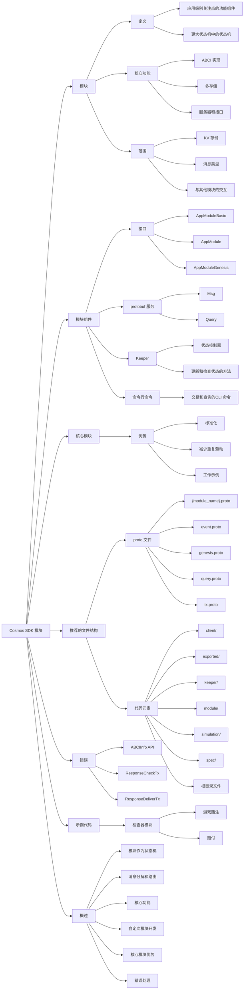

TODO-把这段也整理到脑图里面去:
当一个交易从底层的CometBFT共识引擎传递过来时，它会把这个交易分解成多个部分，然后将这些部分路由到合适的模块进行处理。 

当模块消息处理器接收到这些信息后，才开始解释和执行。

module包括:

1. 一个用于应用链接口的标准实现(ABCI),与CometBFT进行通信。
2. 一个通用的数据存储，负责保存模块状态。
3. 一台服务器和接口，让你能够跟节点进行互动。

core负责连接各个模块并处理基础设施问题，而Modules则承担大部分应用逻辑，能够被组合成更高级别的Modules。

一个Modules定义了整个状态的一个子集，用来：

1. 一到多个键值存储。
2. application需要但还没有的msg类型。

模块也定义了与已经存在的其他模块进行交互。

模块实现了几个元素：

1. interface: 接口促进模块之间的通信，并将多个模块组合成连贯的应用程序。
2. Protobuf: Protobuf 提供了一个 Msg 服务来处理消息，以及一个 gRPC 查询服务来处理查询。
3. Keeper: 一个 Keeper 是一个控制器，定义状态并提供更新和检查状态的方法。
