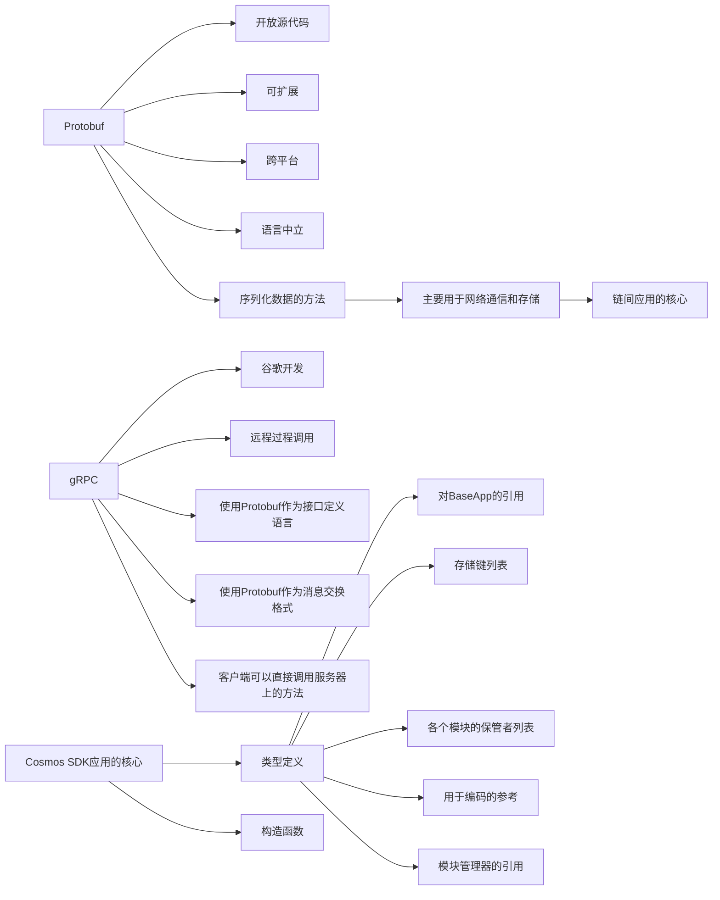

```mermaid
graph LR  
    A[Protobuf] --> B[开放源代码]  
    A --> C[可扩展]  
    A --> D[跨平台]  
    A --> E[语言中立]  
    A --> F[序列化数据的方法]  
    F --> G[主要用于网络通信和存储]  
    G --> H[链间应用的核心]  

    I[gRPC] --> J[谷歌开发]  
    I --> K[远程过程调用]  
    I --> L[使用Protobuf作为接口定义语言]  
    I --> M[使用Protobuf作为消息交换格式]  
    I --> N[客户端可以直接调用服务器上的方法]  

    O[Cosmos SDK应用的核心] --> P[类型定义]  
    O --> Q[构造函数]  
    P --> R[对BaseApp的引用]  
    P --> S[存储键列表]  
    P --> T[各个模块的保管者列表]  
    P --> U[用于编码的参考]  
    P --> V[模块管理器的引用]
```
