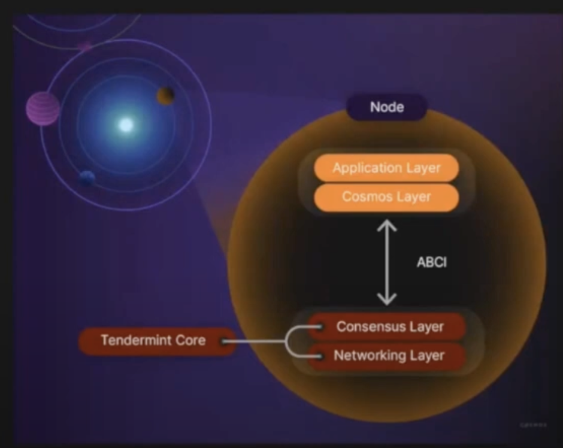
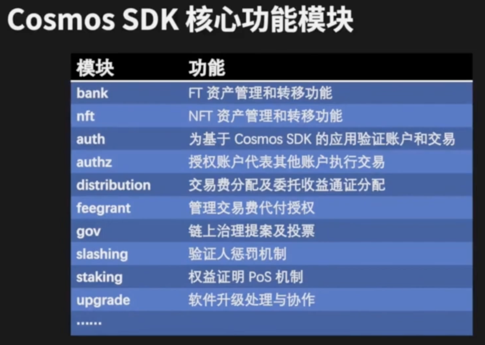
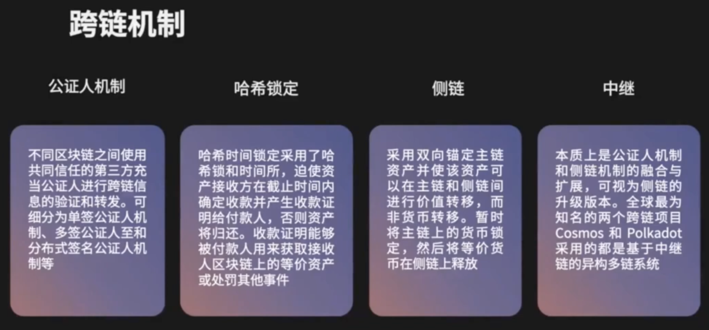
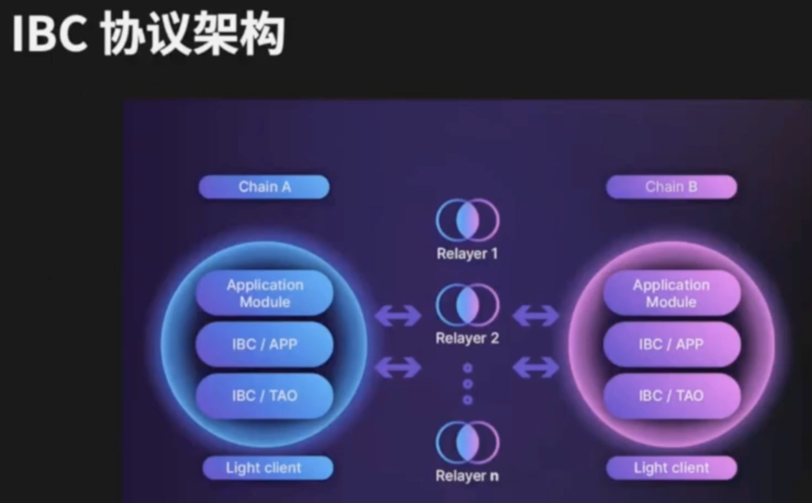
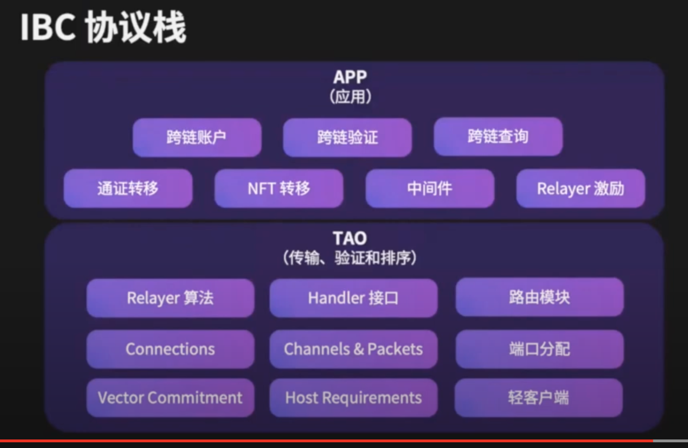
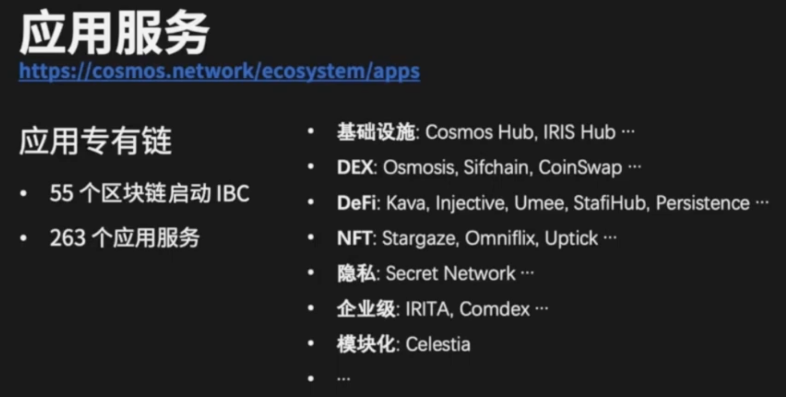
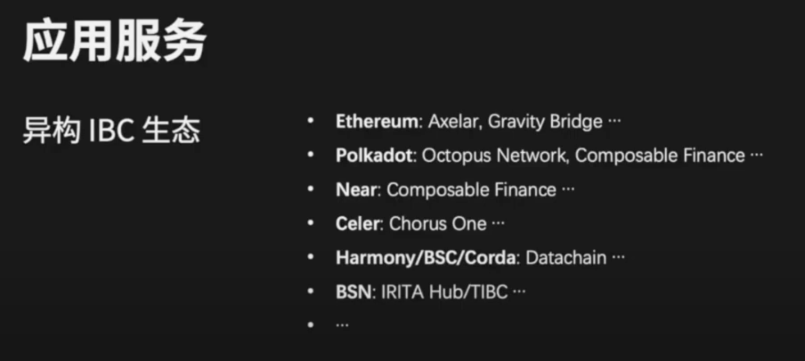
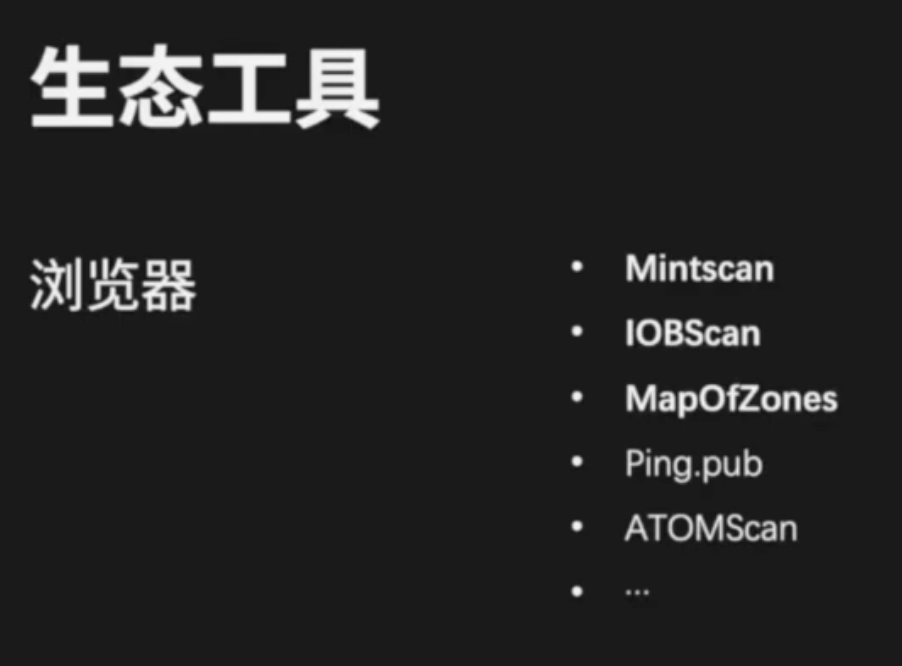

https://www.youtube.com/watch?v=BU4ssRNV55M&list=PL9aoThVN5PLnv8lFQnfXzQ0OHZnmFdqYo&index=1
# 基本概念
## 扩展性

### 水平扩展(向外)

更多的节点

### 垂直扩展

增加网络组建, 提升tps

## 自主性

app chain

自己设计的治理结构

## 互操作性

ibc操作

# 三大组建

## 1. tendermint

不要超过1/3作恶就可以保证安全

### tendermintcore consensus engine

拜占庭容错+slasher

1. 
2. pos权益证明机制
3. 绝对finality, 快速finality(因为不会分叉, 也不会有uncle block)

### abci 

只用关心APP layer开发就行了

不同的node之间通过 abci互相通讯

### abci++

串行+lock, 如何提升?

1. 应用可以修改, 改成应用层对交易进行排序控制
2. 应用层可以参与区块链有效性valid
3. 应用可以parallel/op执行交易
4. 投票扩展解锁强大用例

### 模块化的

### 可定制化的

authz = erc20 approve

feegrant = aa钱包代付gas费用交易费用

upgrade = 软件升级

## 2. ibc跨链协议

34分钟., 没听懂

1. 公证人, 需要依赖于共同信任的第三方(这种风险大)
2. 哈西锁定, 时间锁+哈西锁. 比特币网络出现的. 用于跨链不同token交换, 确保转换资产是原子性. 
3. 侧链, 比特币. 锁定珠帘的资产, 然后再性能更快的侧脸上释放资产. 资产是单向的
4. **中继, cosmos用的就这个, 公证人+侧链的升级版本**

### IBC垮脸通讯协议

让两个不同的区块链之间可靠有序

1. 通证转移

不同的链之间的replayer运行

中继器是链外的, 和链没关系, 不是公证人

lightclient是一个chain对另一个chain的共识信息和状态的存储, 验证人的信息, 不同高度头的信息, 因此可以验证来自另一个链的...

ibc app层...

tao层

web server ibc APP层

ibc数据层

flow1

flow2

---

tao相当于tcp/ip协议, udp都可以

不需要依赖于第三方信任

### 通证转移 ICS-20
ics20施舍么么意思, 就是通证标准

### NFT转移

light-client账户网络

ICS100: 使用哈西索实现通证转移

ICS101: 使用

## 3. 其他创新技术产品

### 启链工具

ignite CLI

cosmos脚手架

快速原型

### 虚拟机

#### 1. ethermint

以太坊的库拿过来的

封装成tendermint, 然后发送打包交易

#### 2. cosmwasm
rust

安全性,合规性会比solidity好

#### 3. gno.land

## 4. 垮脸生态

