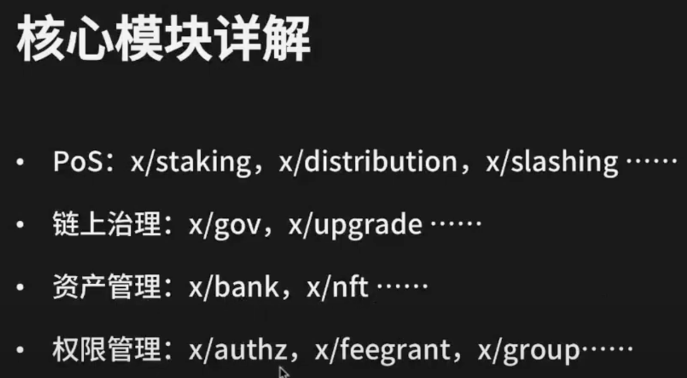

# cosmos sdk

架构分为: 网络层, 共识层, 应用层

网络和共识层都是再tendermint-core里面实现的

1. 不同的区块链节点通过网络层进行互通(交换交易信息)
2. 然后在consensus layer 打包出块
3. 被确认的区块通过ABCI交给应用层进行处理

## tendermint-core时序图

蓝色是abci的逻辑

黑色是非abci的逻辑

白色是tendermint-core的逻辑

橙色是验证者节点的逻辑

### 重点(要背)

1. 用户发起交易 -> 区块链节点
2. 区块链节点接受到交易, 放入自己的tendermint的mempool cache里面
3. tendermint通过abci调用checktx, 交给cosmos-sdk的应用层, 检查交易是否合法, 
4. 如果合法则会进入tendermint 的 mempool;如果不合法就会被拒绝
5. 进入mempool的交易会被tendermint会通过p2p网络广播给其他节点.
6. 大部分其他节点, 接收到这个交易之后, 通过PoS机制选举出一个proposer(这个区块的提议人)
7. proposer就会mempool当中的交易, 打包到这个区块当中. 
8. 再把这个区块, 通过tendermint网络, 广播给其他节点
9. 然后开始共识部分, 共识的过程主要分为两个轮次
10. 在pre-vote阶段, 验证节点会对这个区块进行验证和投票
11. 除了自己投票之外, 验证人节点也在监听全网其他节点的投票
12. 当一个节点接收到的投票超过2/3, 这个时候进入pre-commit阶段
13. pre-commit阶段也是一样的原理, 当超过2/3的节点投了yes之后, 这个区块就会被确认是一个合法的区块.达成了共识
14. 那么接下来这个区块就被通过abci交给应用层, 运行`beginBlock`, `deliverTx`, `endBlock`, 最终执行`commit`
15. commit执行之后, 这个区块就正式的完成了, 区块高度就会增加, 

# 核心功能模块

验证人节点是运行在内网中的

哨兵节点是运行在外网的

验证人节点和哨兵节点通过内网VPC连接

## PoS-staking模块

**配置参数详解**
* unbondingTime: 一个委托人把通证质押给验证人之后的锁定时间(锁定期).
* maxValidators: PoS网络验证人数量上限. 如果超过了, 是按照通证数量排序. 
* bondDenom: 委托的通证类型
* minCommissionRate: 验证人设置的佣金的最小比例?

---

运行验证人节点, 需要有专业的运维人员, 硬件资源, 通证质押

为什么要做验证人:

* 看好生态
* 自己质押通证可以获得PoS收益, 验证人可以收取委托人佣金

做验证人的风险:

* 节点offline时间过长(会被slashing)
* 运维事故导致双签?

## PoS-distribution模块

负责验证人和委托人的PoS收益分发

### 收益来自三个方面:

#### 通证增发

cosmos hub, 委托的越高, 增发的越少. 吸引大家去质押

#### 区块链网络的交易手续费(gas)

奖励给验证人和委托人

#### 委托人要向验证人支付的佣金

### PoS收益分发机制-被动触发

为什么是被动:

如果是主动的话, 那么将会给网络带来很大的压力

#### 1. 提取收益的时候, 必须提取all

#### 2. 委托, 解委托, 或者转委托的时候, 必须触发发起人的全部收益取回

#### 3. 验证人修改佣金比例的时候, 会触发验证人以及该验证人的全部委托人的收益取回

### Distribution模块-参数

* communityTax: 区块的增发,手续费这些收益, 会通过一定的比例存入模块账户, 叫做社区资金池, 可以被大家申请使用
* baseProposerReward/bonusPropserReward: 一个区块的提议人进行额外奖励的参数
* withdrawAddrEnable: 提款地址启用. 是否允许验证人设置自己的收益地址. 

## PoS-slashing

这个模块会对验证人(节点运行有故障的验证人)进行惩罚

惩罚包含两个方面:

* 烧掉一部分验证人委托的通证(包含委托人的)
* 在一段时间内(可能是永久)禁止验证人继续参与共识;

**验证人被惩罚原因**

* node运行故障: offline之类的
* 双签`double sign`: 验证人有两个签名密钥, 并且同时使用他们来签署同一个区块

**参数**

* signedBlocksWindow: 定义了一个时间窗口, 
* minSignedPerWindow: 一个时间窗口内, 验证人最少要完成多少个签名
* downtimeJailDuration: 如果没有完成minSignedPerWindow签名, 则被当成下线处理,关入小黑屋;超过这个时间之后,验证人可以通过`unjail`函数从小黑屋出来. 
* slashFractionDoubleSign: 双签资金惩罚比例
* slashFractionDowntime: xxxx

## 治理-Gov

所有的holder都能参与治理

* 参数治理: 在链上发起提议, 修改模块配置
* 链上升级: 提议在未来指定的区块高度或时间, 执行网络升级
* 社区基金申请: 提议将一定数量的社区基金转入指定账号用于某用途

**参数**

* min_deposit: 发起一个提案最低需要有多少质押,也可以发起一个提案由其他人帮你质押. 如果想更快的进入投票期,也可以在发起提案的同事,放入足额的质押
* max_deposit_period: 如果发起的时候没有足额的质押, 那么这里有一个最大时间期限, 过时不候
* voting_period: 投票阶段的期限
* quorum: 多少人参与这次投票才算有效
* threshold: 多少人参与这次投票才算通过
* veto: 多少人参与了强烈反对, 就会否决提案(优先级最高)

## 治理-upgrade

**原理**

在所有节点, 在预定的高度, 同时停止运行, 然后升级软件版本, 达成新的共识. 
* 加载新的功能模块: 
* 数据的存储结构变更: 

**开发者要做**

* 编写`upgradeHandler`: 
* 编写`migrationHandler`: 老数据到新数据的迁移
* 更新`consensusVersion`: 有哪些模块发生了调整

**开发者要做**

* 关注网络升级提案, 及时升级
* 借助cosmovisor自动升级程序

## bank模块

负责处理账户之间的多资产通证管理

并跟踪特殊情况下的fake转账

如果有需要对用户的资产进行管理的时候可以参考这个模块

**参数**

send_enabled: 创世网络的时候设置成false, 等网络稳定之后设置成true

## NFT模块

* class: NFT类别
* class_id: 全局唯一
* id: 在同一个class下面不可以重复
* 了服了服了

### 如何使用cosmos sdk开发opensea

osmosis组合了bank模块和ibc模块, 并且在这个基础上开发了dex专有链

任何开发者都可以将bank模块和nft模块组合, 开发一个nft专有链

NFT模块本身也具有非常高的可扩展性, 以太坊生态已经有非常多成熟的规范

* EIP-2981: NFT可以为创作者提供永久持续的收益, 除了一次性销售收入外, 创作者还可以享受二级市场每次一转售的收入分成
* EIP-4907: 租赁标准

## authz
允许一个账户给另一个账户授权任意权限(相当于erc-20 approve的通用版)

* 转账权限: 类似于支付宝的亲情付
* staking权限: 可以用于财务和运维权限细分场景, 财务掌管资金, 运维的账号, 只有权限执行委托,解委托,转委托的权限, 还可以限制运维人员选择哪些验证人.

自定义模块设计自己的权限管理, 比如nft租赁的场景, 可以通过authz授权承租人可以使用的nft时限,租赁期间可以对nft执行的操作等等

## feegrant模块

相当于aa钱包的支付手续费的功能.

* 冷热分离: 离线存储的冷账户给热账户授权一定的使用期限和手续费上限
* 资金归集: 例如中心化交易所为每个用户托管multi-chain account, 用于接受用户的入金. 执行资金归集之前, 一般要给不同的链进行gas费用的划转, 一方面划转本身是由成本的, 另一方面手续费是动态的计算, 很难正好转一个数字. 

## group模块

允许创建和管理链上多签账户, 对链上的某一个操作执行某个提案

