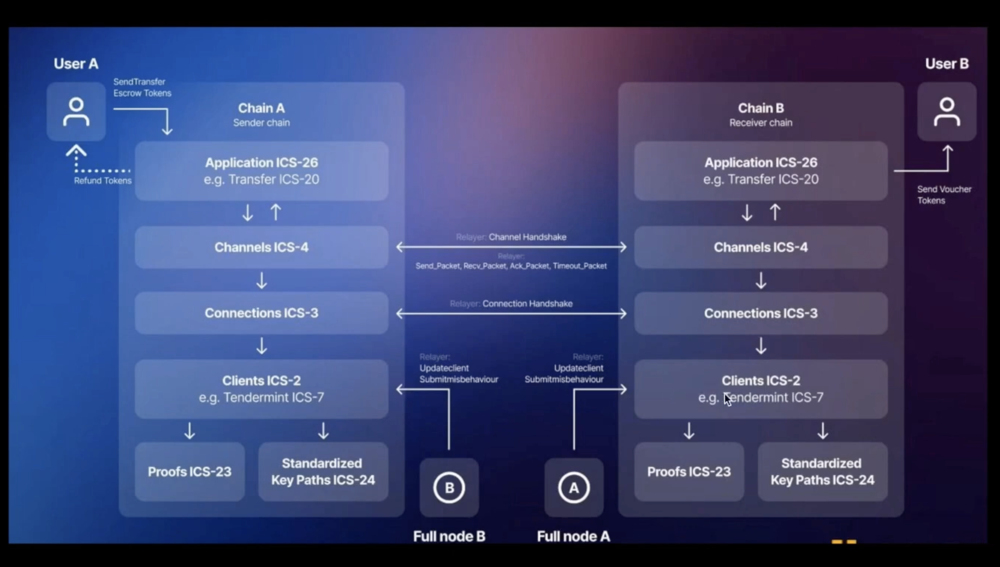

视频url: [youtube](https://www.youtube.com/watch?v=X_mVNDdtnm0&list=PL9aoThVN5PLnv8lFQnfXzQ0OHZnmFdqYo&index=4)

* 一种通用的互操作性协议, 他支持两个不同的区块链互相通信, 而无需信任中间的人

* 超越了垮脸桥, 任何数据都可以通过ibc发送

# IBC工作原理

- 传输层
- - IBC消息通过数据包传输 
- 应用层

# 轻客户端 light client

# 连接 connection

负责连接两个不同链的light client

通过四次握手, 创建连接

# 通道(channel)和port

通过channelID: 可以理解为电脑IP

portID: 端口号, 找到唯一的应用程序

# 中继器

链下

**正常:**

监听A链的交易, 发送给B, 监听b链的交易, 发送ack确认包给A

**fail:**

监听A链的交易, 发送给B, 失败, 中继器发送超时数据包给A, 执行状态回滚操作

只能来回发送, 不能修改(默克尔根保证了消息)

中继器如果宕机只会影响系统的liveness, 不会影响安全

中继器是无需信任的, 因为无法作恶

**缺陷:**

如果有100条链就很复杂

所以推出了`cosmos hub`

对运行中继器的机器, 没有激励, 所以不可持续

# 数据包

由于没有办法保证数据一定送达, 所以需要处理发送失败的情况

IBC通过超时高度/超时timestamp来决定数据包是否发送成功

* 有序通道(ORDER CHANNEL) - 不推荐
- - 一个失败, 后面的都会连续失败
- - 有一个数据包超时, 通道就会被关闭

* 无序通道(ORDER CHANNEL) - 我们应该选择这个
- - 数据包可以任何顺序接受
- - 数据包超时不会导致通道关闭

## 数据包确认

模块可以自行编写特定应用数据包确认逻辑

接受链可选择同步确认或异步确认

# 术语
 - capability: 简单了解就可以
 - Path: 消息不会直接通过网络传递, 而是提交到一个path下面, 这个path是为一个特定的消息类型保留的, 为特定的对手保留的(什么叫特定的对手)
 - Proof: proof会随着消息一起传递给对手链, 用来证明消息的存在

以上术语, ICS20里面都有精确定义

# IBC各组件工作流程

# 什么是ICS20
同质化转账协议

双向锚定

保持总供应量不变

无许可的通证转移

对称, 所有chain都实现相同的逻辑

故障遏制: 防止拜占庭膨胀(什么是拜占庭膨胀)

**什么是拜占庭膨胀**

具体来说，拜占庭膨胀指的是为了解决这个问题，系统必须能够承受多种类型的故障，包括恶意行为、硬件故障、网络延迟等，同时确保系统能够继续达成一致并正常运行。

拜占庭容错系统的核心是设计一种协议，使得即使在存在一部分（通常不超过三分之一）节点表现异常或恶意的情况下，系统仍能保持一致性和正确性。典型的拜占庭容错算法包括：

1. **PBFT（Practical Byzantine Fault Tolerance）**：实用拜占庭容错，是一种著名的实现方法，在N个节点的系统中，能够容忍最多f个拜占庭故障节点（其中N ≥ 3f + 1）。
2. **Tendermint**：一种基于拜占庭容错的共识算法，主要应用于区块链技术中。
3. **HoneyBadgerBFT**：一种异步拜占庭容错协议，能够在不假定同步网络模型的情况下，依然保障系统的安全性和一致性。

通过使用拜占庭容错算法，分布式系统可以在面对不可预测的故障和攻击时仍然维持其可靠性和安全性。这在金融、区块链、关键基础设施等需要高安全性和高可靠性的领域尤为重要。

