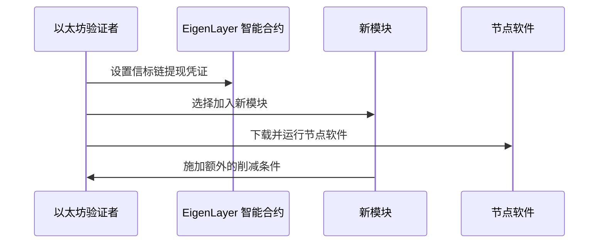

# LSD-Restaking

# 流动性质押和重新质押的区别是什么?

流动性质押（LSD）和重新质押（ReStaking）是两种不同的质押机制，各自具有独特的特点和功能。

### 流动性质押（LSD）
流动性质押是指用户将其加密资产（如ETH）质押到流动性质押协议（如Lido），并获得与质押资产等值的代币（如stETH）。这些代币可以在其他DeFi应用中使用，用户不仅可以分享质押的收益，还可以用这些代币进行交易或兑换回原始资产。流动性质押的主要优势在于它允许用户在质押的同时保持资产的流动性。

### 重新质押（ReStaking）
重新质押是一种机制，允许以太坊质押者通过将其质押的ETH或LST（流动性质押代币）重新质押到EigenLayer等平台，以提供额外的安全性和验证服务。重新质押的核心在于，质押者可以选择将其质押的资产用于多个不同的分布式系统或应用，从而实现资本的重复利用和收益的叠加。通过重新质押，质押者不仅可以为以太坊主网提供安全保障，还可以参与其他新兴的去中心化应用（DApp）或服务。

### 主要区别
1. **流动性**：
   - 流动性质押允许用户在质押的同时保持资产的流动性。
   - 重新质押则侧重于将质押的资产用于多个服务，可能会牺牲部分流动性以获得更高的收益。

2. **收益来源**：
   - 流动性质押的收益主要来自于质押的原始资产。
   - 重新质押的收益则来自于为其他分布式系统提供安全性和验证服务的额外奖励。

3. **参与方式**：
   - 流动性质押通常通过专门的流动性质押协议进行。
   - 重新质押则通过平台（如EigenLayer）进行，质押者可以选择参与不同的模块和服务。

总结来说，流动性质押和重新质押各有其独特的优势和适用场景，用户可以根据自己的需求和风险偏好选择合适的质押方式。
