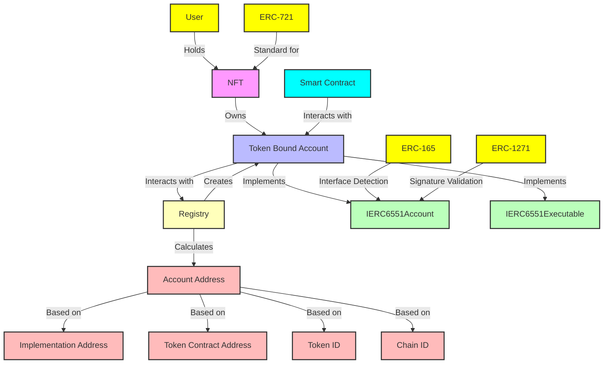
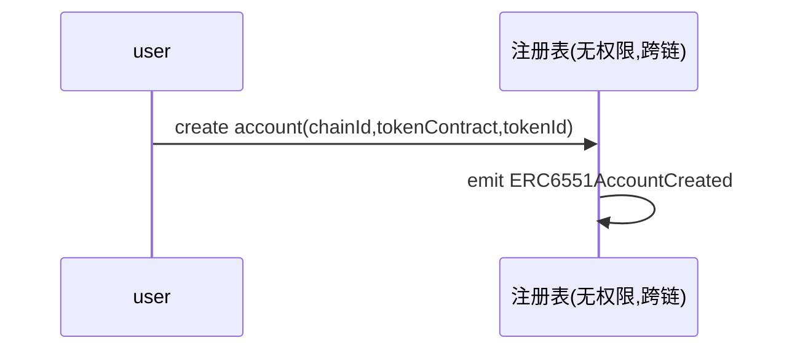

# ERC-6551

`token bound account` 是一种与特定非同质化代币（NFT）绑定的智能合约账户。它允许NFT拥有资产并与应用程序进行交互，赋予NFT像以太坊用户一样的功能，包括自我保管资产、执行任意操作、控制多个独立账户以及在多个链上使用账户。每个`token bound account`通过一个单例注册表创建，确保每个NFT都有唯一且可预测的智能合约账户地址。这种机制使得NFT能够更有效地代表复杂的现实资产。

---

在 `createAccount` 函数中

1. **tokenContract**：
ERC-721地址

2. **implementation**：
 -这是一个地址，指向实现代币绑定账户功能的智能合约。它必须符合 `IERC6551Account` 接口，定义了代币绑定账户的行为和功能。
 -该地址用于指定在创建代币绑定账户时所使用的具体合约实现。

总结来说，`tokenContract` 是与特定 NFT相关的合约地址，而 `implementation` 是用于创建和管理代币绑定账户的合约实现地址。两者在功能和用途上是不同的。

---

