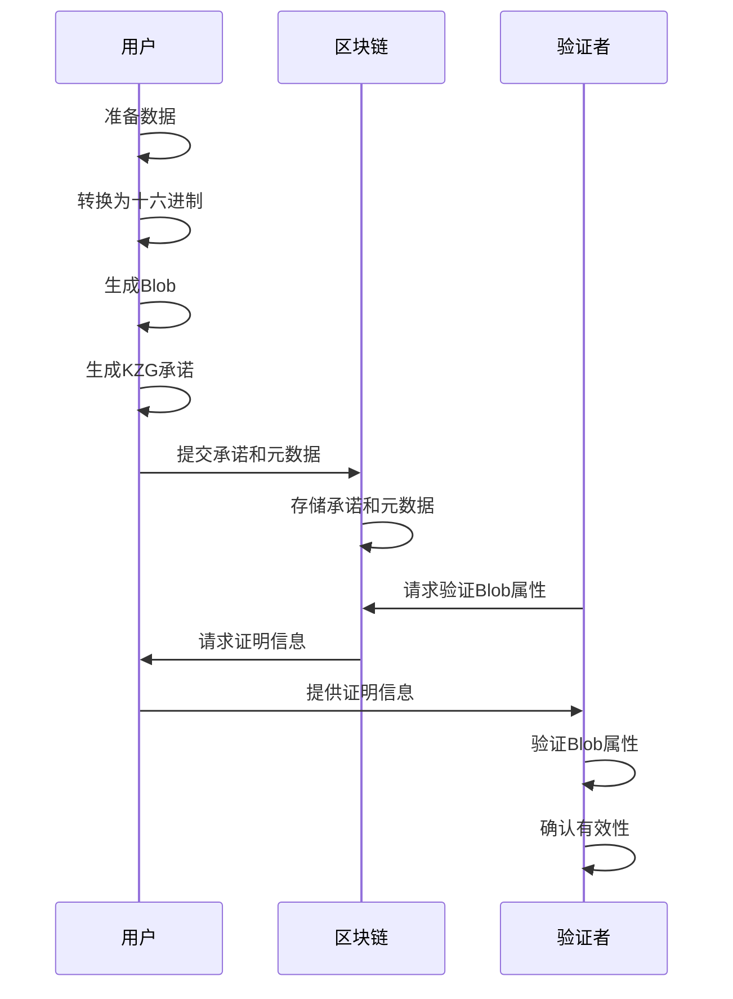
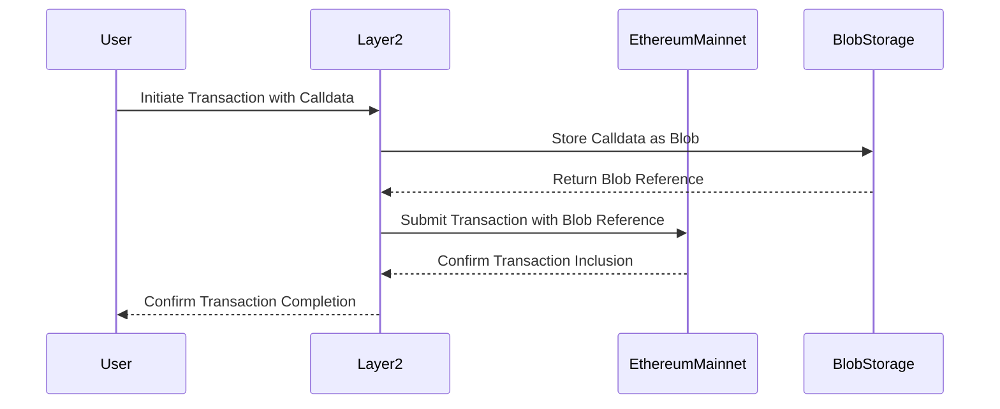

## EIP-4844

https://www.cyfrin.io/blog/what-is-eip-4844-proto-danksharding-and-blob-transactions

### How do rollups validate transactions now?

1. You submit a transaction with a blob, along with some proof data

你提交了一个包含blob的transaction，并附上一些证明数据

2. Your contract on-chain accesses a hash of the blob with the BLOBHASH opcode

你的链上合约通过BLOBHASH指令访问了这个blob的哈希值。

3. It then will pass your blob-hash combined with your proof data to the new point evaluation opcode to help verify the transactions batch 

然后会将你的 blob-hash 与证明数据一起`new point evaluation opcode`来帮助验证batch中的 transaction 的正确性。

备注: 这步骤只能验证你上传到blob和你的证明数据是一一对应的并且是正确的, 并不能证明你的L2上的交易都是validated.

