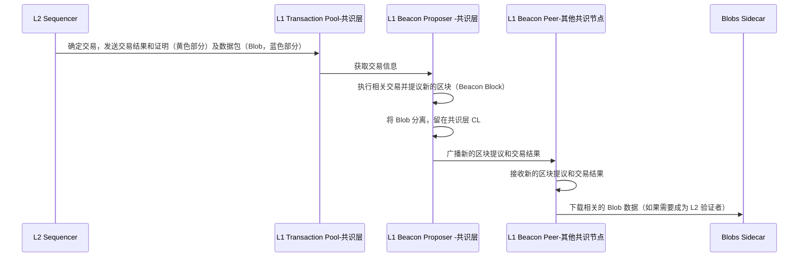
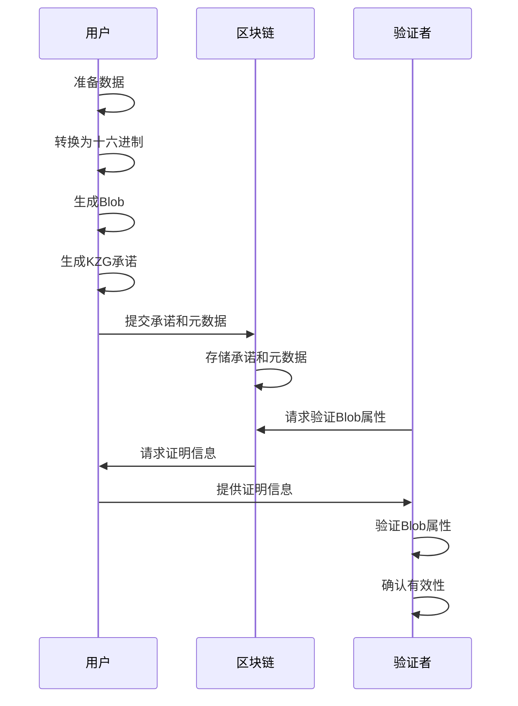
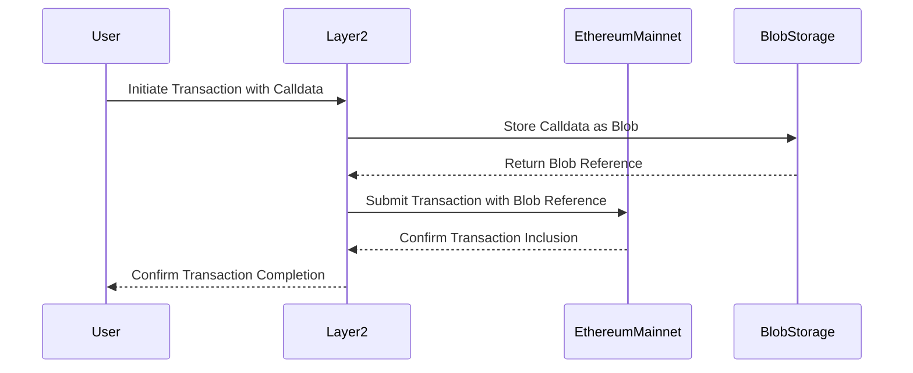
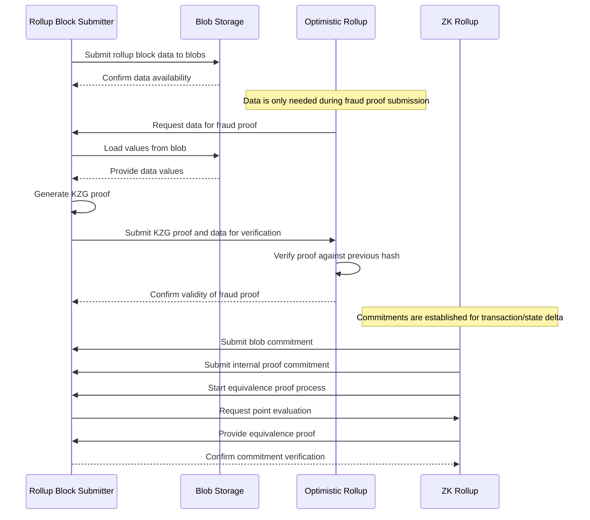

# EIP-4844

# 文章1

https://www.theblockbeats.info/news/33063

### 对以上文章的总结

1. blob是共识层的东西, 存在共识节点, 不会进执行层/evm
2. 引入feemarket: 独立于L1
3. 不能像 Calldata 那样被 EVM 所读取
4. 有生命周期，在 30 天之后将被删除

为什么节点不需要下载所有的data blobs?为什么能通过DAS进行验证?

1. blob数据被存在共识节点中. 只有需要的时候才会被特定节点访问.
2. DAS 允许节点下载一部分blobs, 不需要完整数据的情况下, 就能验证数据的正确性. 

# 直接翻译的EIP

https://learnblockchain.cn/article/7586

## blob 交易 TransactionPayloadBody 各字段解释如下：

- chain_id：链 ID 。

- nonce：发送者账户的交易计数器。

- max_priority_fee_per_gas：最大优先费用（小费）。

- max_fee_per_gas：最大总费用（包括基础费用）每单位 gas 。

- gas_limit：交易可使用的最大gas 量。

- value：以 wei 为单位的发送的以太币数量。

- data：交易的输入数据。

- access_list：一个访问列表，包括交易执行过程中需要访问的地址和存储键，以优化 gas 消耗和提高交易执行效率。

- blob 交易非常规字段（与 EIP-1559 的语义不同）：

- - to ：接收方的20 字节地址，不同于 EIP-1559，但它不能为 nil。这意味着 blob 交易不能用来创建合约。

- blob 交易独有字段：

- - max_fee_per_blob_gas ：uint256，用户指定的愿意给出的每单位 blob gas 的最大费用。
- - blob_versioned_hashes：方法 {kzg_to_versioned_hash} 的哈希输出列表，即一个数组，一个区块用到几个 blob 数组内就会有几个元素，每个元素为一个 blob 的 VersionedHash （即版本化哈希值，对 blob 的数据进行承诺，由方法 {kzg_to_versioned_hash} 基于 KZG 承诺生成）。

## 共识层验证

在共识层上，blob 数据被引用，但不是编码在信标区块体中，而是被作为侧车数据（sidecars）单独传播。

本 EIP 中的“侧车”设计允许 blob 数据与信标区块体分开传播，使 blob 数据可以独立地被网络中的节点接收和处理。这种侧车数据的设计，将 is_data_available() 黑盒化，为进一步的数据增加提供了前向兼容性：通过完全分片，is_data_available() 可以被数据可用性采样 (DAS, data-availability-sampling) 取代，从而避免所有 blob 被所有信标节点下载。

数据可用性采样 (DAS, data-availability-sampling)：Danksharding 提出的一个方案，用于实现降低节点负担的同时也保证了数据可用性。其思想是将 blob 中的数据切割成数据碎片，并且让节点由下载 blob 数据转变为随机抽查 blob 数据碎片，让 blob 的数据碎片分散在以太坊的每个节点中，但是完整的 blob 数据却保存在整个以太坊账本中，前提是节点需要足够多且去中心化。

---

### blob_versioned_hashes

a list of hash outputs from kzg_to_versioned_hash.

## networking

Blob交易有两种网络表示。在交易传播响应（PooledTransactions）中，Blob交易的EIP-2718 TransactionPayload被封装成：

- tx_payload_body - is the TransactionPayloadBody of standard EIP-2718 blob transaction
- blobs - list of Blob items
- commitments - list of KZGCommitment of the corresponding blobs
- proofs - list of KZGProof of the corresponding blobs and commitments

---

https://www.cyfrin.io/blog/what-is-eip-4844-proto-danksharding-and-blob-transactions

### How do rollups validate transactions now?

1. You submit a transaction with a blob, along with some proof data

你提交了一个包含blob的transaction，并附上一些证明数据

2. Your contract on-chain accesses a hash of the blob with the BLOBHASH opcode

你的链上合约通过BLOBHASH指令访问了这个blob的哈希值。

3. It then will pass your blob-hash combined with your proof data to the new point evaluation opcode to help verify the transactions batch 

然后会将你的 blob-hash 与证明数据一起`new point evaluation opcode`来帮助验证batch中的 transaction 的正确性。

备注: 这步骤只能验证你上传到blob和你的证明数据是一一对应的并且是正确的, 并不能证明你的L2上的交易都是validated.

