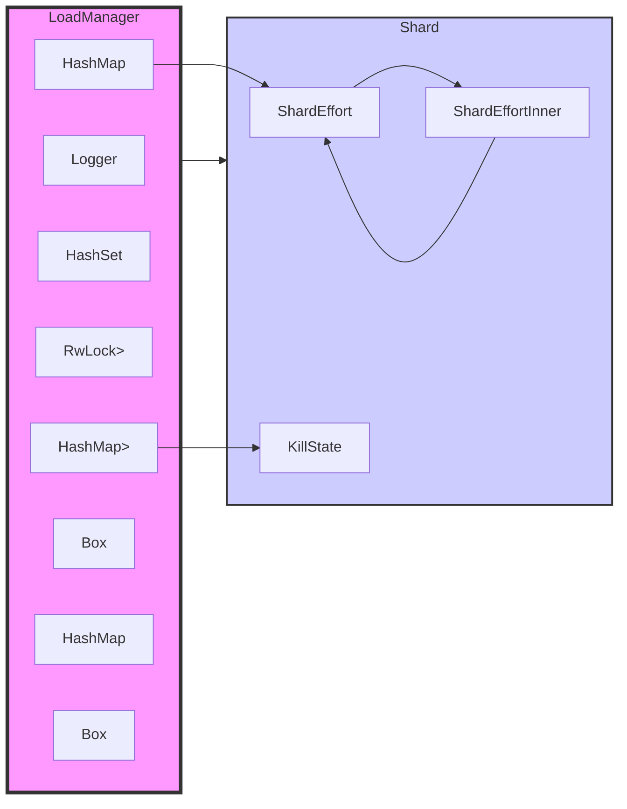
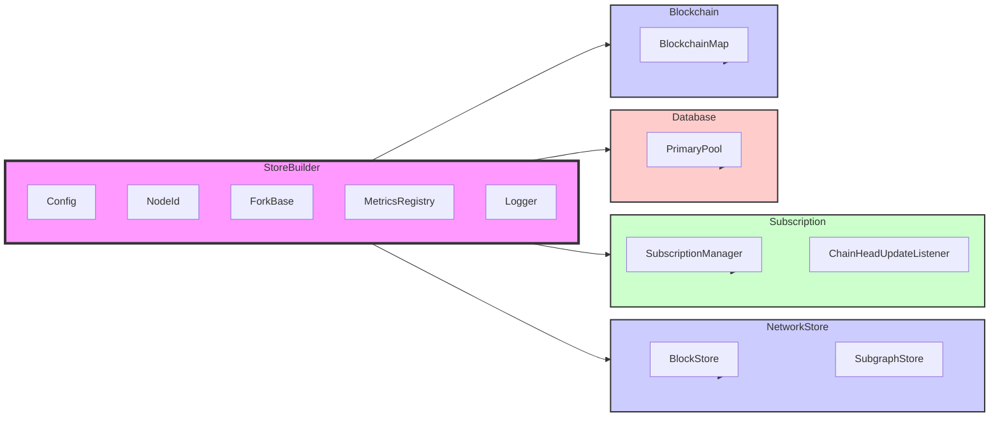
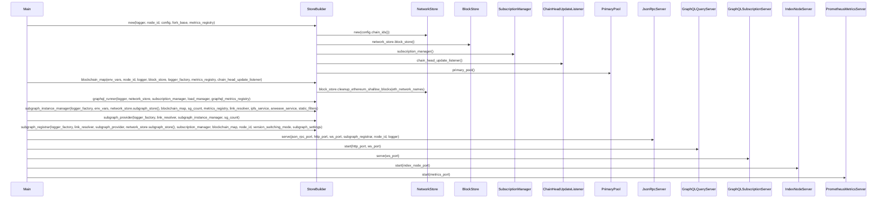
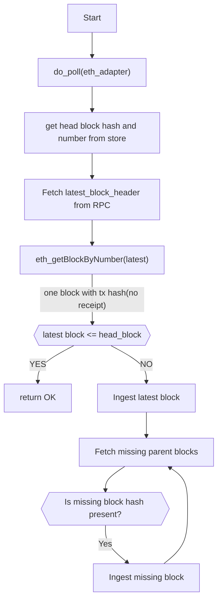
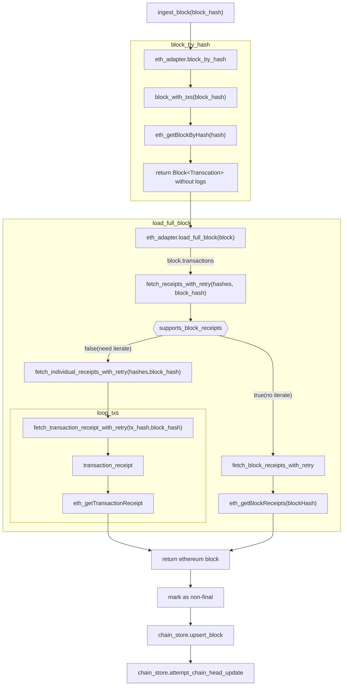
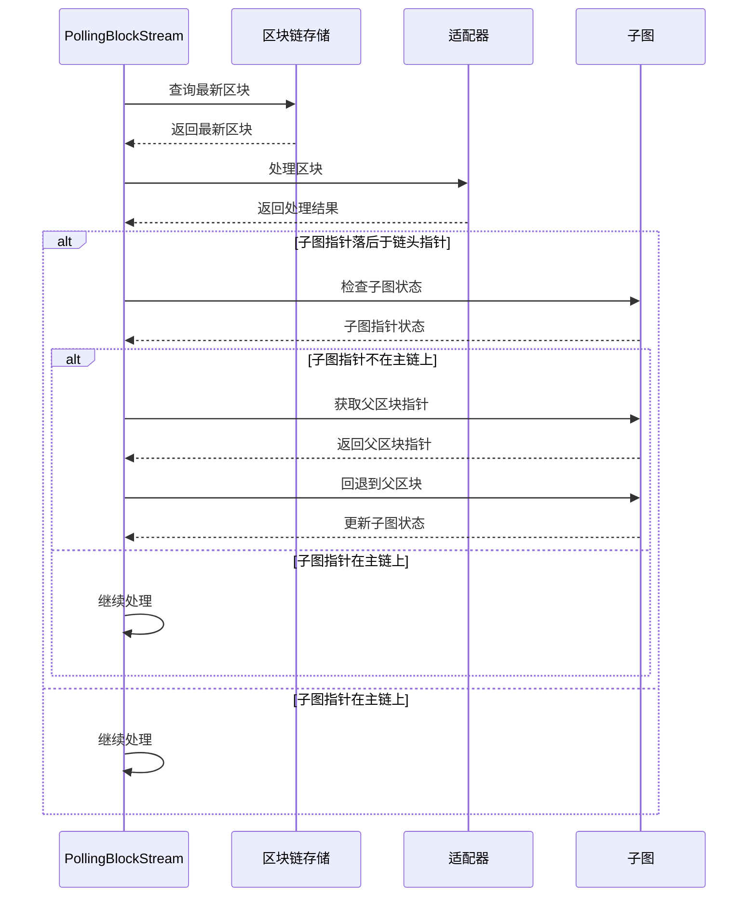
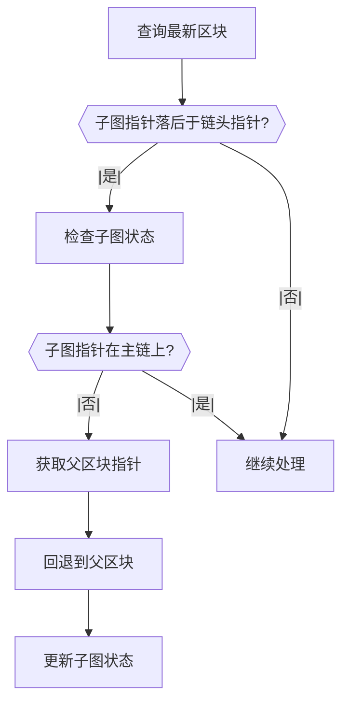
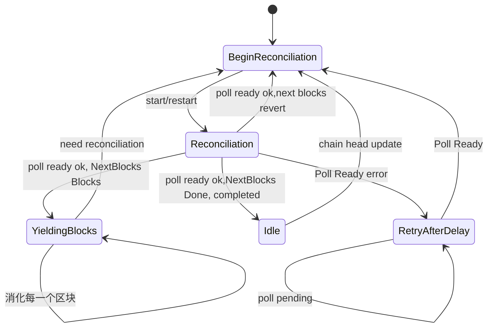

# LoadManager

# Storebuilder

## Architechture Graph

## Sequence Diagram

# main

```mermaid
flowchart TD
    start["Start"]
    env_vars["Load environment variables"]
    opt["Parse command-line options"]
    logger["Initialize logger"]
    version["Log version information"]
    poi_protection["Check POI protection"]
    config["Load configuration"]
    subgraph_settings["Load subgraph settings"]
    check_config["Check configuration"]
    node_id["Create node ID"]
    subgraph_["Obtain subgraph-related arguments"]
    ports["Obtain server ports"]
    fork_base["Obtain fork base URL"]
    elastic_config["Obtain Elasticsearch logging configuration"]
    prometheus["Set up Prometheus registry"]
    logger_factory["Create logger factory"]
    ipfs_clients["Create IPFS clients"]
    ipfs_service["Create IPFS service"]
    arweave_resolver["Create Arweave resolver"]
    arweave_service["Create Arweave service"]
    link_resolver["Create link resolver"]
    metrics_server["Create metrics server"]
    endpoint_metrics["Create endpoint metrics"]
    graphql_metrics_registry["Create GraphQL metrics registry"]
    contention_logger["Create contention logger"]
    expensive_queries["Read expensive queries"]
    store_builder["Create store builder"]
    launch_services["Launch services"]
    end_["END"]

    start --> env_vars
    env_vars --> opt
    opt --> logger
    logger --> version
    version --> poi_protection
    poi_protection --> config
    config --> subgraph_settings
    subgraph_settings --> check_config
    check_config --> node_id
    node_id --> subgraph_
    subgraph_ --> ports
    ports --> fork_base
    fork_base --> elastic_config
    elastic_config --> prometheus
    prometheus --> logger_factory
    logger_factory --> ipfs_clients
    ipfs_clients --> ipfs_service
    ipfs_service --> arweave_resolver
    arweave_resolver --> arweave_service
    arweave_service --> link_resolver
    link_resolver --> metrics_server
    metrics_server --> endpoint_metrics
    endpoint_metrics --> graphql_metrics_registry
    graphql_metrics_registry --> contention_logger
    contention_logger --> expensive_queries
    expensive_queries --> store_builder
    store_builder --> launch_services
    launch_services --> end_
```

# launch services

```mermaid
flowchart TD
    start["Start"]
    subscription_manager["Get subscription manager"]
    chain_head_update_listener["Get chain head update listener"]
    primary_pool["Get primary pool"]
    network_store["Get network store"]
    block_store["Get block store"]
    validator["Create validator"]
    network_adapters["Create network adapters"]
    blockchain_map["Create blockchain map"]
    cleanup_ethereum_shallow_blocks["Clean up Ethereum shallow blocks"]
    blockchain_map_arc["Create Arc<blockchain_map>"]
    shards["Get shards"]
    load_manager["Create load manager"]
    graphql_runner["Create GraphQL runner"]
    graphql_server["Create GraphQL server"]
    subscription_server["Create subscription server"]
    index_node_server["Create index node server"]
    block_ingestors["Start block ingestors"]
    job_runner["Create job runner"]
    register_store_jobs["Register store jobs"]
    static_filters["Get static filters"]
    subgraph_count["Create subgraph count metric"]
    subgraph_instance_manager["Create subgraph instance manager"]
    subgraph_provider["Create subgraph provider"]
    version_switching_mode["Get version switching mode"]
    subgraph_registrar["Create subgraph registrar"]
    spawn_subgraph_registrar["Spawn subgraph registrar"]
    json_rpc_server["Start JSON-RPC server"]
    add_cli_subgraph["Add CLI subgraph"]
    spawn_graphql_server["Spawn GraphQL server"]
    spawn_subscription_server["Spawn subscription server"]
    spawn_index_node_server["Spawn index node server"]
    spawn_metrics_server["Spawn metrics server"]

    start --> subscription_manager
    subscription_manager --> chain_head_update_listener
    chain_head_update_listener --> primary_pool
    primary_pool --> network_store
    network_store --> block_store
    block_store --> validator
    validator --> network_adapters
    network_adapters --> blockchain_map
    blockchain_map --> cleanup_ethereum_shallow_blocks
    cleanup_ethereum_shallow_blocks --> blockchain_map_arc
    blockchain_map_arc --> shards
    shards --> load_manager
    load_manager --> graphql_runner
    graphql_runner --> graphql_server
    graphql_runner --> subscription_server
    subscription_server --> index_node_server
    blockchain_map_arc --> block_ingestors
    block_ingestors --> job_runner
    job_runner --> register_store_jobs
    register_store_jobs --> static_filters
    static_filters --> subgraph_count
    subgraph_count --> subgraph_instance_manager
    subgraph_instance_manager --> subgraph_provider
    subgraph_provider --> version_switching_mode
    version_switching_mode --> subgraph_registrar
    subgraph_registrar --> spawn_subgraph_registrar
    spawn_subgraph_registrar --> json_rpc_server
    json_rpc_server --> add_cli_subgraph
    add_cli_subgraph --> spawn_graphql_server
    spawn_graphql_server --> spawn_subscription_server
    spawn_subscription_server --> spawn_index_node_server
    spawn_index_node_server --> spawn_metrics_server
```

# do_poll

# ingest_block.eth_adapter

# block pooling stream

# PollingBlockStream
Reconciliation: 

在数据流或数据库的上下文中，reconciliation 意味着确保不同数据源之间的信息一致。例如，合并来自不同来源的数据，以消除差异和不一致。

yield:

在这里，yield 表示从一个过程（区块流的对齐）中逐步产生输出（即区块），让系统处理这些区块。这个过程通常在异步编程中使用，以允许在计算中有序地发出结果，而不是一次性返回所有结果。

