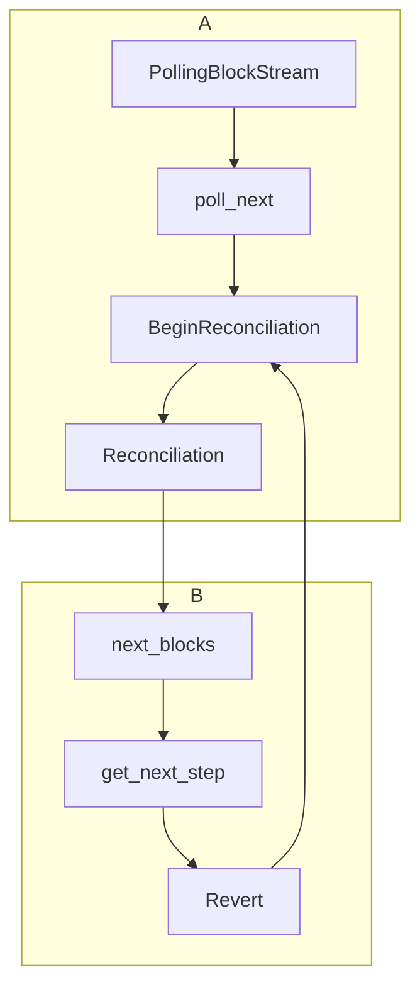
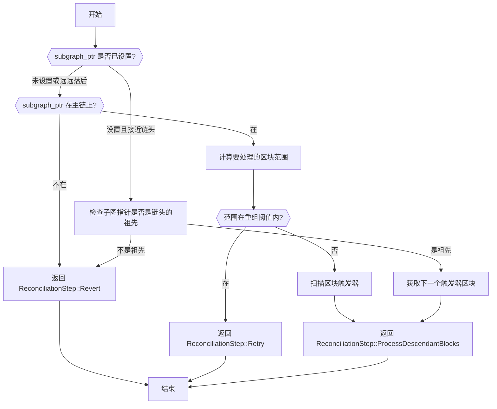

# 调用流程

### head_ptr(数据库中)

子图指针位于头指针之后

### subgraph_ptr(数据库中)
指向尚未确认的区块，通常是正在处理、验证或等待确认的区块。

# get_next_step

决定下一步做什么, 不修改数据库. 

你提供的函数 get_next_step 负责在子图和类以太坊区块链之间的对账过程中确定下一步。

# 函数 - 数据库操作 - 回滚

`store/postgres/src/relational.rs`

`pub fn revert_block()`

一个个block revert, 而不是一连串

通过 RevertRemoveQuery 查询所有在当前区块 block 及其之后的版本。这些版本将被删除。

# 落差区块的参数的意义是什么?

- 平衡RPC请求, 设置的过小可能导致频繁访问当前区块是不是在main chain上面
- 如果设置的过小, 可能导致回滚的时候, 需要多回滚几个区块
- 设置的刚刚好可以在同步历史数据的时候, 批量扫block, 加快同步速度