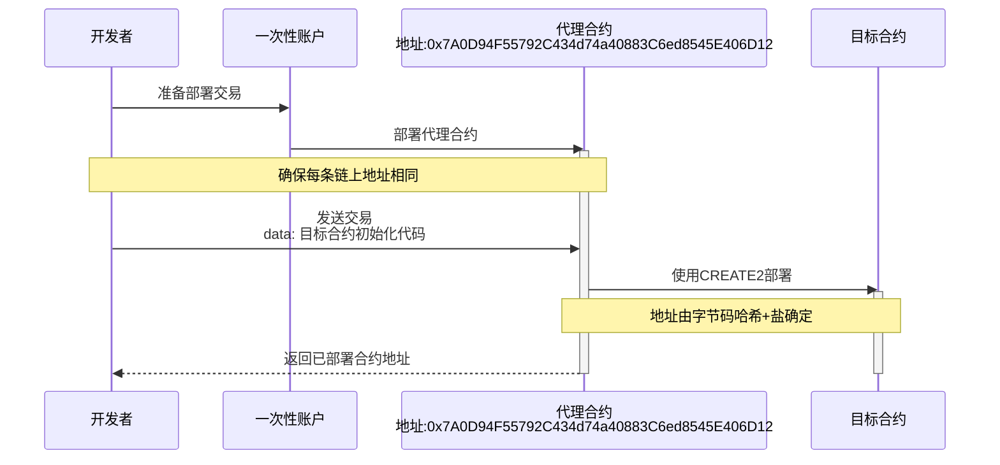

```mermaid
sequenceDiagram
    participant Dev as 开发者
    participant OneTimeAccount as 一次性账户
    participant ProxyContract as 代理合约<br/>地址:0x7A0D94F55792C434d74a40883C6ed8545E406D12
    participant TargetContract as 目标合约

    Dev ->> OneTimeAccount: 准备部署交易
    OneTimeAccount ->> ProxyContract: 部署代理合约
    activate ProxyContract
    
    Note over Dev,ProxyContract: 确保每条链上地址相同
    
    Dev ->> ProxyContract: 发送交易<br/>data: 目标合约初始化代码
    ProxyContract ->> TargetContract: 使用CREATE2部署
    activate TargetContract
    
    Note over ProxyContract,TargetContract: 地址由字节码哈希+盐确定
    
    ProxyContract -->> Dev: 返回已部署合约地址
    deactivate TargetContract
    deactivate ProxyContract
```