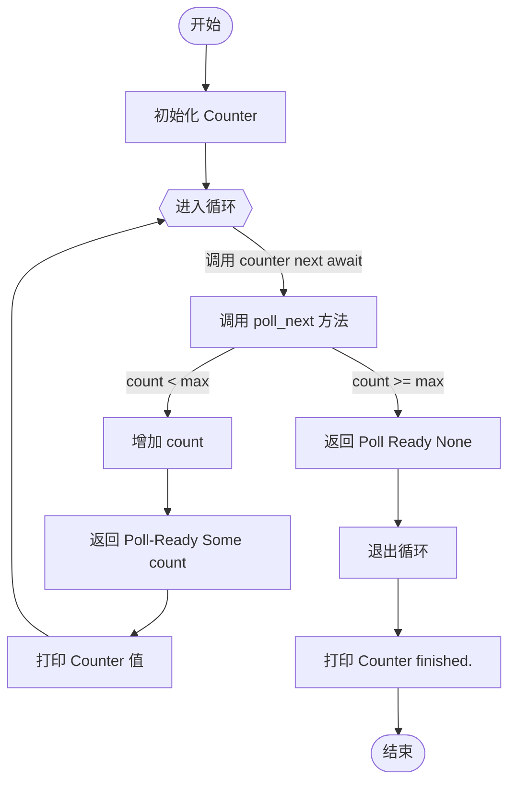

# Rust Stream

```rust
use std::pin::Pin;
use std::task::{Context, Poll};
use futures::Stream;

struct Counter {
    count: usize,
    max: usize,
}

impl Counter {
    fn new(max: usize) -> Self {
        Counter { count: 0, max }
    }
}

impl Stream for Counter {
    type Item = usize;

    fn poll_next(mut self: Pin<&mut Self>, _cx: &mut Context<'_>) -> Poll<Option<Self::Item>> {
        if self.count < self.max {
            self.count += 1;
            Poll::Ready(Some(self.count))
        } else {
            Poll::Ready(None) // 流已结束
        }
    }
}

#[tokio::main]
async fn main() {
    let mut counter = Counter::new(3);

    while let Some(value) = counter.next().await {
        println!("Counter: {}", value);
    }

    println!("Counter finished.");
}
```

