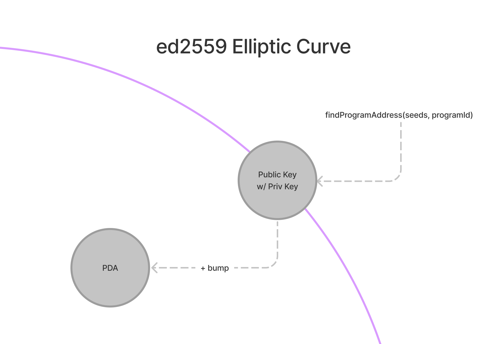
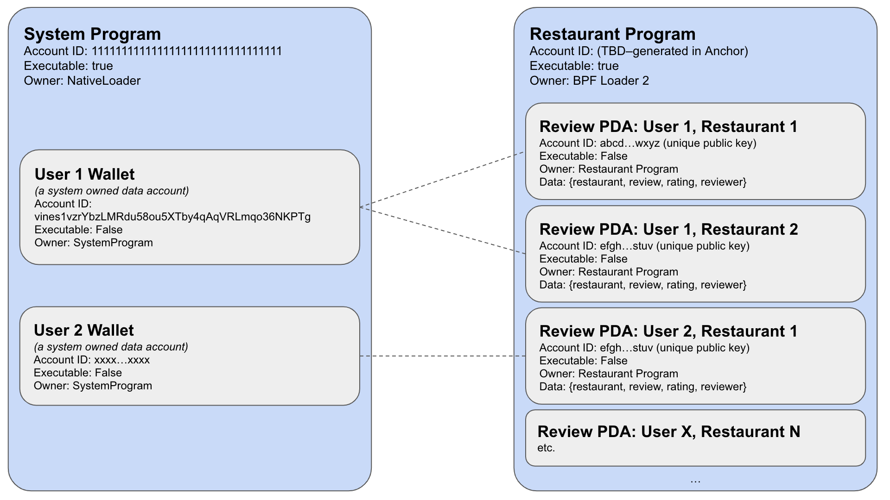
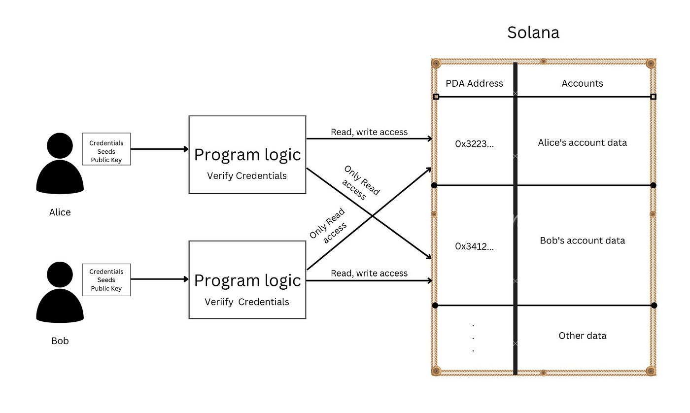

# pda

## 选择题
```
1. 程序派生地址（PDAs）是设计为由程序签名而不是私钥签名的账户地址。正如名称所示，PDAs 是使用程序 ID 派生的。
A. 正确
B. 错误

2. PDAs 是使用哪些输入来查找或派生的？
A. 程序 ID 和一组可选的“种子（seeds）”
B. 私钥和公钥
C. 用户 ID 和密码
D. 电子邮件和电话号码

3. 为了确保结果不在 Ed25519 曲线上，`find_program_address` 函数添加了一个称为什么的数字种子？
A. 碰撞种子（bump seed）
B. 种子种子（seed seed）
C. 生长种子（grow seed）
D. 派生种子（derive seed）

4. `try_find_program_address` 函数引入了什么变量，取值范围在 0 到 255 之间？
A. bump_seed
B. seed_list
C. program_id
D. address

```

----

```
1. 程序派生地址（PDAs）是设计为由程序签名而不是私钥签名的账户地址。正如名称所示，PDAs 是使用程序 ID 派生的。
A. 真
B. 假
C. 错误
D. 无效
Answer: A
Citation: "程序派生地址（Program Derived Addresses，PDAs）是设计为由程序签名而不是私钥签名的账户地址。正如名称所示，PDAs 是使用程序 ID 派生的。"

2. PDAs 是使用哪些输入来查找或派生的？
A. 程序 ID 和一组可选的“种子（seeds）”
B. 私钥和公钥
C. 用户 ID 和密码
D. 电子邮件和电话号码
Answer: A
Citation: "PDAs 是使用程序 ID 和一组可选的“种子（seeds）”来查找或派生的。"

3. 为了确保结果不在 Ed25519 曲线上，`find_program_address` 函数添加了一个称为什么的数字种子？
A. 碰撞种子（bump seed）
B. 种子种子（seed seed）
C. 生长种子（grow seed）
D. 派生种子（derive seed）
Answer: A
Citation: "为了确保结果_不在_ Ed25519 曲线上，因此没有私钥，`find_program_address` 函数添加了一个称为碰撞种子（bump seed）的数字种子。"

4. `try_find_program_address` 函数引入了什么变量，取值范围在 0 到 255 之间？
A. bump_seed
B. seed_list
C. program_id
D. address
Answer: A
Citation: "`try_find_program_address` 函数引入了 `bump_seed`。`bump_seed` 是一个取值范围在 0 到 255 之间的 `u8` 变量。"
```

## 问答题


1. 什么是程序派生地址（PDAs）？

答：程序派生地址是由程序签名而不是私钥签名的账户地址，通过程序 ID 和可选的种子派生而来。

2. PDAs 具有哪两个主要功能？

答：PDAs的两个主要功能是为程序提供确定性的方式来查找给定的数据项，以及授权从中派生PDA的程序代表其签名。

3. 如何在Solana程序中查找PDA？

答：要在Solana程序中查找PDA，可以使用`find_program_address`函数，该函数接受一个可选的“种子”列表和一个程序ID作为输入，然后返回PDA和一个bump种子。

4. 为什么使用PDA账户来存储与程序相关的数据是一种常见的设计选择？

答：因为程序本身是无状态的，程序状态是通过外部账户进行管理的。使用PDA账户可以使用种子进行映射，并且程序可以代表自己进行签名，这使得PDA账户成为一种常见的设计选择。

5. 如何映射数据存储在PDA账户中？

答：有两种方法可以映射数据存储在PDA账户中：一种是创建一个PDA“映射”账户，存储各种账户地址，并指向这些账户中存储的数据；另一种是有策略地使用种子来定位适当的PDA账户并检索必要的数据。





