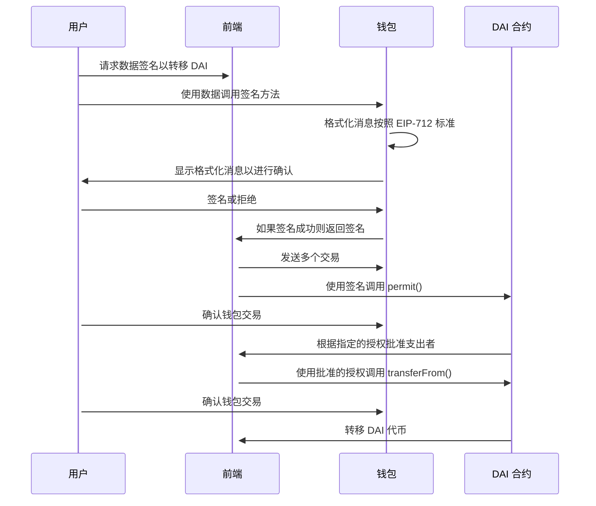

# ERC20 Permit
1. 记录nounce值
2. permit函数（拿到签名和hash msg 和原始msg， 进行解密signer，并验证是否正确），如果正确就approve token给指定地址。注意，参数里需要带上截止时间，否则容易被黑客攻击

```mermaid
sequenceDiagram
    participant 用户
    participant Application as 前端
    participant 钱包
    participant DAI 合约

    用户->>+Application: 请求数据签名以转移 DAI
    用户->>+钱包: 使用数据调用签名方法
    钱包->>钱包: 格式化消息按照 EIP-712 标准
    钱包->>+用户: 显示格式化消息以进行确认
    用户->>钱包: 签名或拒绝
    钱包->>+Application: 如果签名成功则返回签名
    Application->>钱包: 发送多个交易
    Application->>DAI 合约: 使用签名调用 permit()
    用户->>钱包: 确认钱包交易
    DAI 合约->>Application: 根据指定的授权批准支出者
    Application->>DAI 合约: 使用批准的授权调用 transferFrom()
    用户->>钱包: 确认钱包交易
    DAI 合约->>Application: 转移 DAI 代币
```

