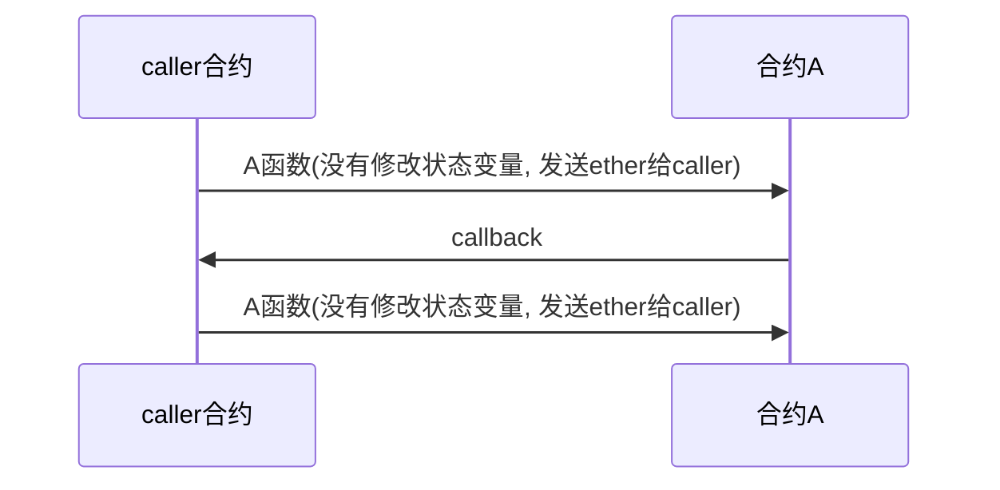
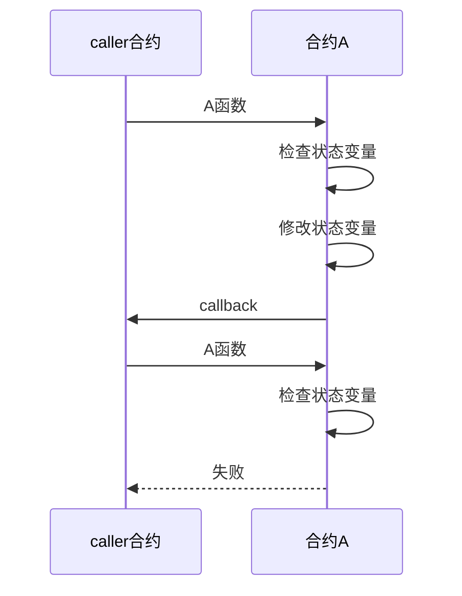

# 重入漏洞

重入漏洞, 简单的说就是, 在合约处理A函数的时候, 没有先把状态变量进行修改, 而先对caller合约进行了callback, 这时候caller合约重复调用合约该A函数, 从而进行攻击


### 攻击流程




### 无法攻击的流程



```
interface ReiceveInterface{
  function onReceive() external{}
}
contract MyContract{
  function withDraw(uint amount) external{
  // 检查是否有用户的代币还有多少个
  // 扣掉要提取的部分
  ReiceveInterface(msg.sender).onReceive();
  }
}
```

用于攻击的合约

```
contract Attactor{
  uint count =0;
  function start() external{
    onReceive();
  }
  
  function onReceive() external{
    if(time<9){
      count+=1;
      MyContract(0x...).withDraw(1 ether);
    }
  }
}
```

这样就会出现循环调用，导致取款的时候，检查用户余额出错，导致可能已经没钱了，但是依旧可以取钱。
解决方法就是用openzeppelin的nonReentrent修饰符。
