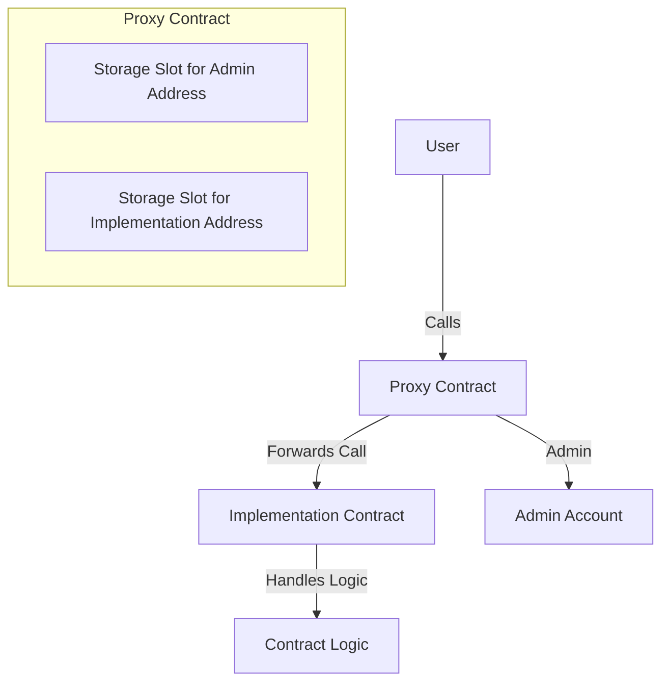
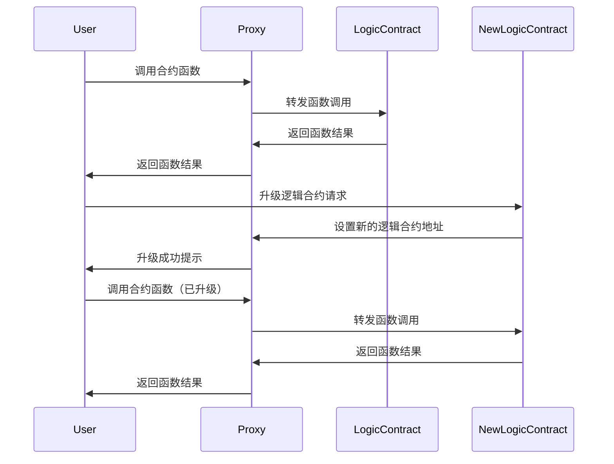
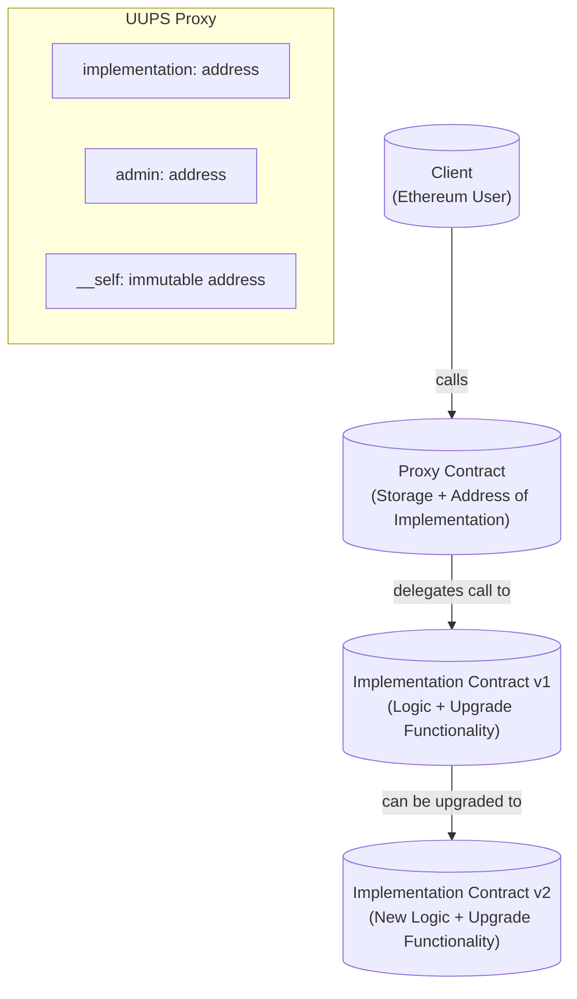
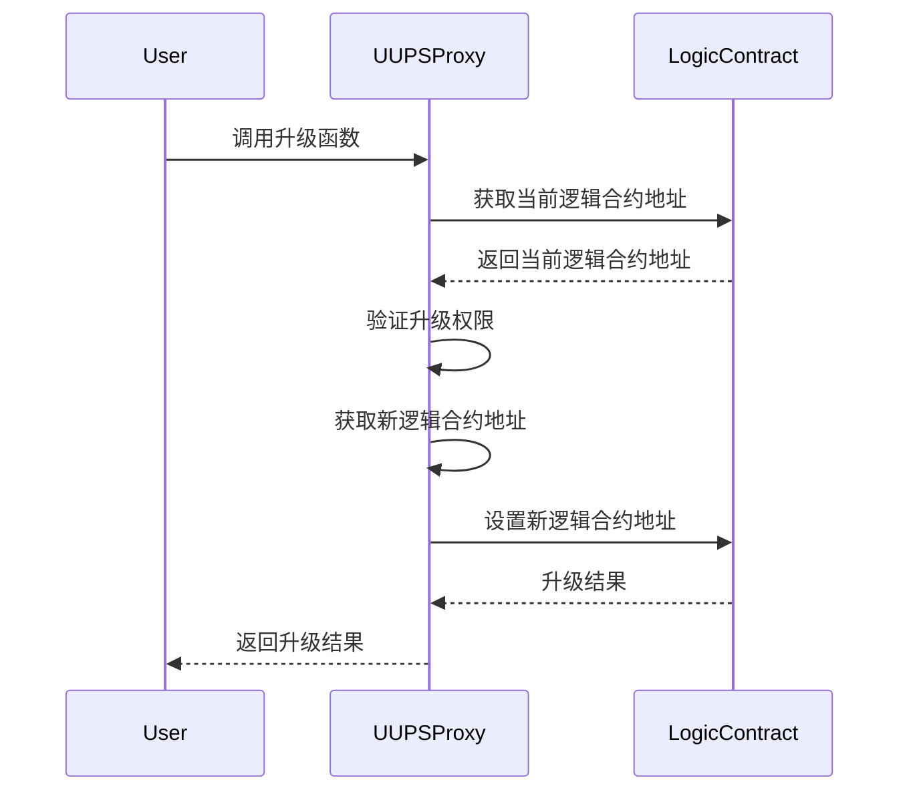

# 透明代理 transparent(最常用)

代理合约的执行原理: 

当无法匹配函数selector的时候, 函数会调用fallback/receive,接着会使用delegatecall调用逻辑合约

为什么用fallback而不是receive, receive能干的事情也就2300gas

msg.data != null and receive exites => call receive

什么是msg.data, 其实就是calldata, 也就是selector + input params组合

函数选择器 = bytes4 = 8 * 2^16

selector = bytes4(keccak256("burn(uint256)"));

如果出现同一个合约两个函数的选择器一样, 那么就不会通过编译

if 逻辑合约的a函数 = 代理合约的升级函数

管理人通过代理调用a函数的时候, 就会把代理合约升级成一个黑洞合约, 因为选择器是一样的嘛

那么我们禁止管理员调用任何逻辑合约的函数, 就能解决这个问题. (在fallback中校验)

* 管理人只能调用代理合约的升级函数(fallback中把管理员禁了)
* 其他用户不能调用可升级函数 但是可以调用逻辑合约的函数(在upgrade函数中把非管理员禁了)

这样做的缺点: 

每次都要检查, 消耗多余gas

## arch

## flow

# UUPS的代理合约(TODO)

如何解决逻辑合约的函数和代理合约的升级函数的选择器冲突呢?

把升级函数放入逻辑合约中.

通过这样的方式, 把数据都存在了代理合约上, 逻辑合约不存储任何东西, 但是必须保持两个合约的插槽一样, 否则引起冲突.

## arch

 

## flow

