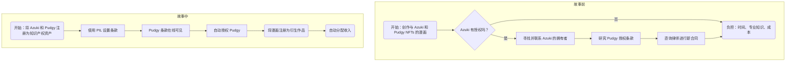

```mermaid
flowchart TD
    subgraph 故事前 
        A1("开始：创作与 Azuki 和 Pudgy NFTs 的漫画")
        A2{"Azuki 有授权吗？"}
        A3["寻找并联系 Azuki 的拥有者"]
        A4["研究 Pudgy 授权条款"]
        A5["咨询律师进行新合同"]
        A6("负担：时间、专业知识、成本")
        A1 --> A2 
        A2 -- 否 --> A6 
        A2 -- 是 --> A3 --> A4 --> A5 --> A6 
    end 
    
    subgraph 故事中 
        B1("开始：将 Azuki 和 Pudgy 注册为知识产权资产")
        B2["使用 PIL 设置条款"]
        B3["Pudgy 条款在线可见"]
        B4["自动授权 Pudgy"]
        B5("将漫画注册为衍生作品")
        B6("自动分配收入")
        B1 --> B2 --> B3 --> B4 --> B5 --> B6 
    end
```

```mermaid
graph TD
A[用户] -->|创建IP| B[IP Repository]
 B -->|存储IP| C[链上IP存储库]
 C -->|确认所有权| D[智能合约]
 D -->|管理IP生命周期| E[版本控制]
 E -->|生成子IP| F[许可模块]
 F -->|出售子IP| G[创作者]
 G -->|使用子IP| H[共同创作模块]
 H -->|生成新内容| I[流动性模块]
 I -->|拆分所有权| J[版税共享模块]
 J -->|共享版税| K[参与者]
 K -->|获取激励| L[开发者社区]
 L -->|提供支持| M[众筹工具]
 M -->|发现IP| N[资产认证]
 N -->|发展社区| O[IP生态系统]
 style A fill:#f9f,stroke:#333,stroke-width:2px style B fill:#bbf,stroke:#333,stroke-width:2px style C fill:#bbf,stroke:#333,stroke-width:2px style D fill:#bbf,stroke:#333,stroke-width:2px style E fill:#bbf,stroke:#333,stroke-width:2px style F fill:#bbf,stroke:#333,stroke-width:2px style G fill:#bbf,stroke:#333,stroke-width:2px style H fill:#bbf,stroke:#333,stroke-width:2px style I fill:#bbf,stroke:#333,stroke-width:2px style J fill:#bbf,stroke:#333,stroke-width:2px style K fill:#bbf,stroke:#333,stroke-width:2px style L fill:#bbf,stroke:#333,stroke-width:2px style M fill:#bbf,stroke:#333,stroke-width:2px style N fill:#bbf,stroke:#333,stroke-width:2px style O fill:#bbf,stroke:#333,stroke-width:2px

```

