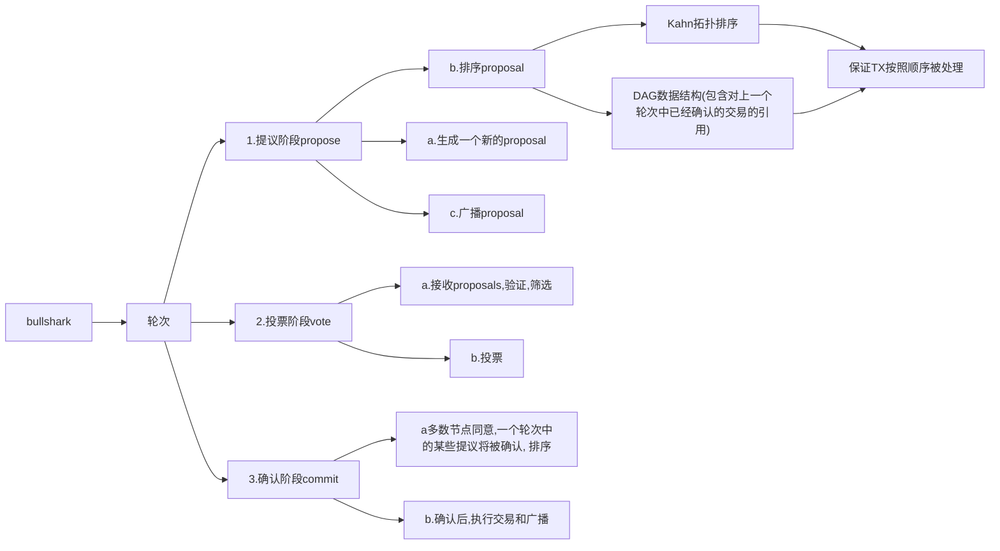
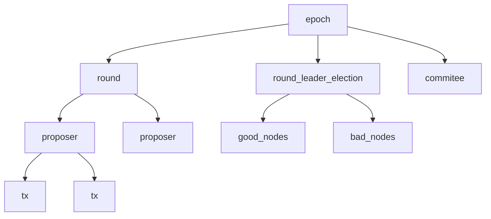

```mermaid

flowchart LR
  node_1["bullshark"]
  node_2["轮次"]
  node_3["1.提议阶段propose"]
  node_4["2.投票阶段vote"]
  node_5["3.确认阶段commit"]
  node_6["b.排序proposal"]
  node_7["DAG数据结构(包含对上一个轮次中已经确认的交易的引用)"]
  node_8["Kahn拓扑排序"]
  node_9["保证TX按照顺序被处理"]
  node_10["a.生成一个新的proposal"]
  node_11["c.广播proposal"]
  node_12["a.接收proposals,验证,筛选"]
  node_13["b.投票"]
  node_15["a多数节点同意,一个轮次中的某些提议将被确认, 排序"]
  node_16["b.确认后,执行交易和广播"]
  node_1 --> node_2
  node_2 --> node_3
  node_2 --> node_4
  node_2 --> node_5
  node_3 --> node_6
  node_6 --> node_7
  node_6 --> node_8
  node_8 --> node_9
  node_7 --> node_9
  node_3 --> node_10
  node_3 --> node_11
  node_4 --> node_12
  node_4 --> node_13
  node_5 --> node_15
  node_5 --> node_16

```

```mermaid
flowchart TB
  node_1["round"]
  node_2["proposer"]
  node_3["proposer"]
  node_4["tx"]
  node_5["tx"]
  node_6["epoch"]
  node_7["round_leader_election"]
  node_8["commitee"]
  node_10["good_nodes"]
  node_11["bad_nodes"]
  node_1 --> node_2
  node_1 --> node_3
  node_2 --> node_4
  node_2 --> node_5
  node_6 --> node_1
  node_6 --> node_7
  node_6 --> node_8
  node_7 --> node_10
  node_7 --> node_11
```
