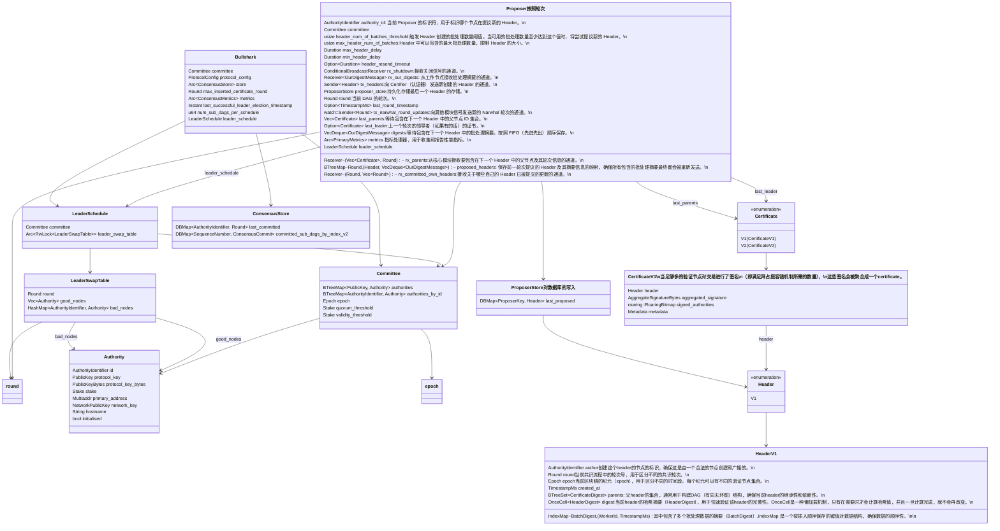

```mermaid

classDiagram
    class Certificate {
        <<enumeration>>
        V1(CertificateV1)
        V2(CertificateV2)
    }
    
    class `CertificateV1\n当足够多的验证节点对交易进行了签名\n（即满足拜占庭容错机制所需的数量），\n这些签名会被聚合成一个certificate。` {
        Header header
        AggregateSignatureBytes aggregated_signature
        roaring::RoaringBitmap signed_authorities
        Metadata metadata
    }

    class Bullshark {
        Committee committee
        ProtocolConfig protocol_config
        Arc~ConsensusStore~ store
        Round max_inserted_certificate_round
        Arc~ConsensusMetrics~ metrics
        Instant last_successful_leader_election_timestamp
        u64 num_sub_dags_per_schedule
        LeaderSchedule leader_schedule
    }


    class LeaderSchedule {
        Committee committee
        Arc~RwLock~LeaderSwapTable~~ leader_swap_table
    }
    class LeaderSwapTable {
        Round round
        Vec~Authority~ good_nodes
        HashMap~AuthorityIdentifier, Authority~ bad_nodes
    }
    LeaderSwapTable-->round


    class Authority {
        AuthorityIdentifier id
        PublicKey protocol_key
        PublicKeyBytes protocol_key_bytes
        Stake stake
        Multiaddr primary_address
        NetworkPublicKey network_key
        String hostname
        bool initialised
    }


    class ConsensusStore {
        DBMap~AuthorityIdentifier, Round~ last_committed
        DBMap~SequenceNumber, ConsensusCommit~ committed_sub_dags_by_index_v2
    }

    class `Proposer按照轮次` {
        AuthorityIdentifier authority_id#58; 当前 Proposer 的标识符，用于标识哪个节点在提议新的 Header。\n
        Committee committee
        usize header_num_of_batches_threshold#58;触发 Header 创建的批处理数量阈值。当可用的批处理数量至少达到这个值时，将尝试提议新的 Header。\n
        usize max_header_num_of_batches#58;Header 中可以包含的最大批处理数量，限制 Header 的大小。\n
        Duration max_header_delay
        Duration min_header_delay
        Option~Duration~ header_resend_timeout
        ConditionalBroadcastReceiver rx_shutdown#58;接收关闭信号的通道。\n
        Receiver~(Vec~Certificate~, Round) ~ rx_parents#58;从核心模块接收要包含在下一个 Header 中的父节点及其轮次信息的通道。\n
        Receiver~OurDigestMessage~ rx_our_digests#58; 从工作节点接收批处理摘要的通道。\n
        Sender~Header~ tx_headers#58;向 Certifier（认证器）发送新创建的 Header 的通道。\n
        ProposerStore proposer_store#58;持久化存储最后一个 Header 的存储。\n
        Round round#58;当前 DAG 的轮次。\n
        Option~TimestampMs~ last_round_timestamp
        watch:#58;Sender~Round~ tx_narwhal_round_updates#58;向其他模块信号发送新的 Narwhal 轮次的通道。\n
        Vec~Certificate~ last_parents#58;等待包含在下一个 Header 中的父节点 ID 集合。\n
        Option~Certificate~ last_leader#58;上一个轮次的领导者（如果有的话）的证书。\n
        VecDeque~OurDigestMessage~ digests#58;等待包含在下一个 Header 中的批处理摘要。按照 FIFO（先进先出）顺序保存。\n
        BTreeMap~Round, (Header, VecDeque~OurDigestMessage~) ~ proposed_headers#58; 保存前一轮次提议的 Header 及其摘要信息的映射，确保所有包含的批处理摘要最终都会被重新发送。\n
        Receiver~(Round, Vec~Round~) ~ rx_committed_own_headers#58;接收关于哪些自己的 Header 已被提交的更新的通道。\n
        Arc~PrimaryMetrics~ metrics 指标处理器，用于收集和报告性能指标。\n
        LeaderSchedule leader_schedule
    }
    `Proposer按照轮次`-->round

    class Committee {
        BTreeMap~PublicKey, Authority~ authorities
        BTreeMap~AuthorityIdentifier, Authority~ authorities_by_id
        Epoch epoch
        Stake quorum_threshold
        Stake validity_threshold
    }


    Committee-->epoch

    class `ProposerStore对数据库的写入` {
        DBMap~ProposerKey, Header~ last_proposed
    }

    class Header {
        <<enumeration>>
        V1
    }

    class HeaderV1 {
        AuthorityIdentifier author创建这个header的节点的标识，确保这是由一个合法的节点创建和广播的。\n
        Round round当前共识流程中的轮次号，用于区分不同的共识轮次。\n
        Epoch epoch当前区块链的纪元（epoch），用于区分不同的时间段。每个纪元可以有不同的验证节点集合。\n
        TimestampMs created_at
        IndexMap~BatchDigest, (WorkerId, TimestampMs) 其中包含了多个批处理数据的摘要（BatchDigest）,IndexMap 是一个按插入顺序保存的键值对数据结构，确保数据的顺序性。\n\n
        BTreeSet~CertificateDigest~ parents#58; 父header的集合，通常用于构建DAG（有向无环图）结构，确保当前header的继承性和依赖性。\n
        OnceCell~HeaderDigest~ digest#58;当前header的哈希摘要（HeaderDigest），用于快速验证该header的完整性。OnceCell是一种懒加载机制，只有在需要时才会计算哈希值，并且一旦计算完成，就不会再改变。\n
    }


    %% Relationships
    Bullshark --> Committee

    Bullshark --> ConsensusStore
    Bullshark --> LeaderSchedule

    LeaderSchedule --> Committee
    LeaderSchedule --> LeaderSwapTable

    LeaderSwapTable --> Authority : bad_nodes


    LeaderSwapTable --> Authority : good_nodes


    `Proposer按照轮次` --> Committee
    `Proposer按照轮次` --> `ProposerStore对数据库的写入`
    `Proposer按照轮次` --> LeaderSchedule : leader_schedule

    Committee --> Authority

    Certificate --> `CertificateV1\n当足够多的验证节点对交易进行了签名\n（即满足拜占庭容错机制所需的数量），\n这些签名会被聚合成一个certificate。`

    `Proposer按照轮次` --> Certificate : last_parents

    `ProposerStore对数据库的写入` --> Header
    `CertificateV1\n当足够多的验证节点对交易进行了签名\n（即满足拜占庭容错机制所需的数量），\n这些签名会被聚合成一个certificate。` --> Header : header


    Header --> HeaderV1

    `Proposer按照轮次` --> Certificate : last_leader


```

epoch:  commitee, 

epoch --> round

round: leader_swap_talbe(good_nodes, bad_nodes), proposer(DAG)
 
 